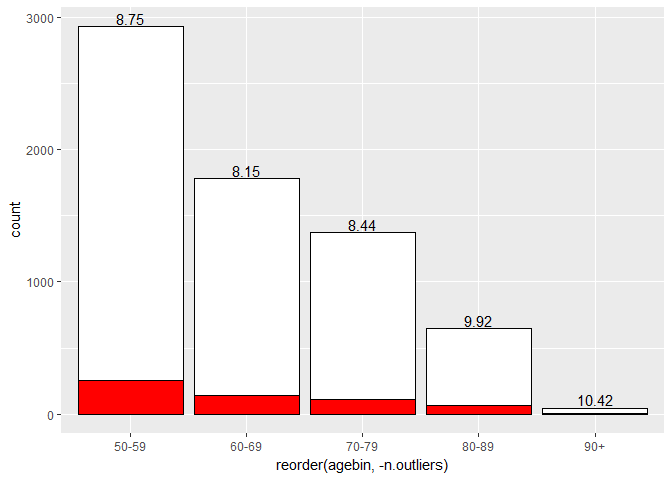
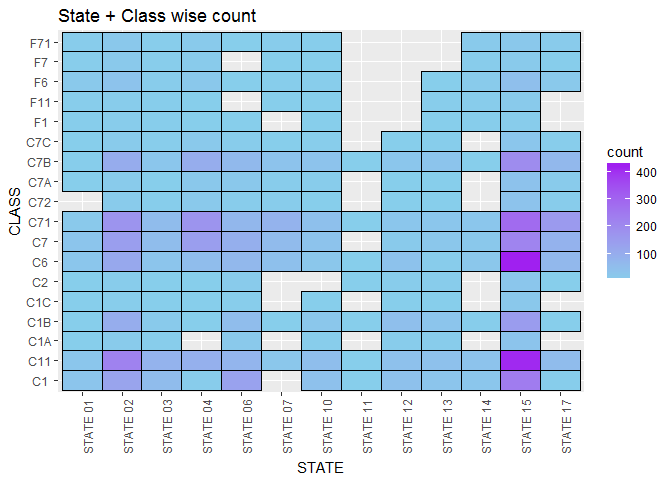
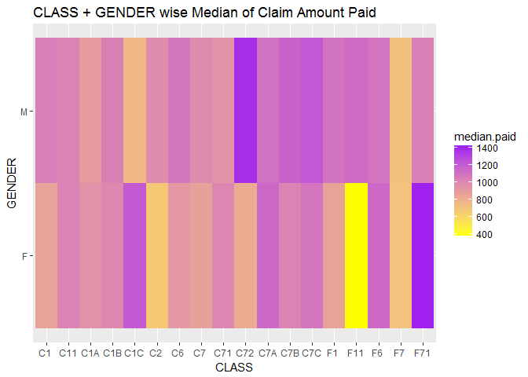
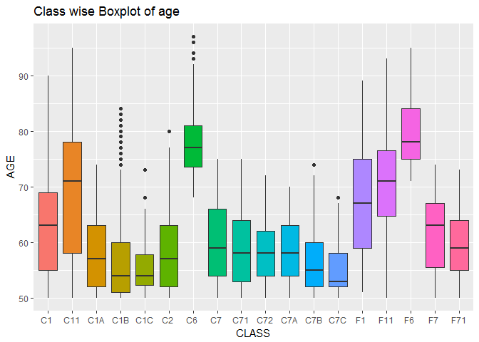

Automoblie Insurance Claim - EDA, Statistical Tests and Model Fitting
================
Pulkit Sikri

About the data
--------------

Claims experience from a large midwestern (US) property and casualty insurer for private passenger automobile insurance. The dependent variable is the amount paid on a closed claim, in (US) dollars (claims that were not closed by year end are handled separately). Insurers categorize policyholders according to a risk classification system. This insurer's risk classification system is based on automobile operator characteristics and ve- hicle characteristics, and these factors are summarized by the risk class categorical variable CLASS.

### Variables

-   STATE - Codes 01 to 17 used, with each code randomly assigned to an actual individual state
-   CLASS - Rating class of operator, based on age, gender, marital status, use of vehicle, as coded in a separate PDF file
-   GENDER
-   AGE
-   PAID - Amount paid to settle and close a claim

Source: <http://instruction.bus.wisc.edu/jfrees/jfreesbooks/Regression%20Modeling/BookWebDec2010/data.html>

``` r
auto.claims = read.csv('C:\\Users\\Administrator\\Desktop\\practice\\AutoClaims.csv')

library(dplyr)
library(ggplot2)
library(corrplot)
library(reshape2)
library(xgboost)
library(caTools)
```

Univariate Analysis
-------------------

``` r
ggplot(auto.claims,aes(x=STATE,fill = STATE))+
  geom_bar()+
  theme(axis.text.x = element_text(angle = 90))+
  labs(title = "State wise count")
```


``` r
ggplot(auto.claims,aes(x=CLASS,fill = CLASS))+
  geom_bar()+
  theme(axis.text.x = element_text(angle = 90))+
  labs(title = "Class wise count")
```


``` r
gender = auto.claims %>% group_by(GENDER) %>% summarise(count = round(n()*100/nrow(auto.claims),2))
pie(gender$count,
    labels = c(paste("Females - ",gender$count[1],"%"),paste("Males - ",gender$count[2],"%")),
    main = "Males V/S Females",
    col = c("light pink","sky blue")
    )
```


``` r
auto.claims$agebin = cut(auto.claims$AGE,c(0,59,69,79,89,Inf),labels = c("50-59","60-69","70-79","80-89","90+"))

ggplot(auto.claims,aes(x=agebin,fill = agebin))+
  geom_bar()+
  labs(title="Age-bin wise count")
```


``` r
ggplot(auto.claims,aes(x="Claim",y=PAID))+
  geom_boxplot()+
  labs(title= "Box-Plot of Claim Paid")
```


From the above boxplot we can see that the there are a lot of outliers for the amount of claim paid, let's see how it looks like after remvoing the outliers

``` r
outlier.limit = quantile(auto.claims$PAID,probs = 0.75)+1.5*IQR(auto.claims$PAID)

ggplot(auto.claims,aes(x=PAID))+
  geom_histogram(bins = 15,fill = "purple",col = "black")+
  scale_x_continuous(limits = c(0,outlier.limit))+
  theme_dark()
```

    ## Warning: Removed 586 rows containing non-finite values (stat_bin).


We observe that Amount of claim is right-skewed

``` r
qqnorm(auto.claims$PAID)
```


Looking the histogram and the QQ-plot of amount of claim PAID, we can see that it is not normally distributed and is highly skewed. Therefore, we will use non-parametric tests in our further analysis.

Analysis with target variable PAID
----------------------------------

### STATE

``` r
ggplot(auto.claims,aes(x=STATE,y=PAID,fill = STATE))+
  geom_boxplot(show.legend = F)+
  scale_y_continuous(limits = c(0,outlier.limit))+
  theme(axis.text.x = element_text(angle = 90,hjust = 1))+
  ggtitle(label = "State - Wise Box Plot for Amount of Claim Paid",subtitle = "(Excluding Outliers from the main data)")
```


We can observer that the amount of claim paid varies according to different States, let us now test statisticaly if these differences are significant.

``` r
kruskal.test(PAID ~ STATE,data = auto.claims)
```

    ## 
    ##  Kruskal-Wallis rank sum test
    ## 
    ## data:  PAID by STATE
    ## Kruskal-Wallis chi-squared = 57.798, df = 12, p-value = 5.67e-08

Since p-value is less than 0.05, we will reject our null hypothesis that Claims Paid do not differ according to different States and we'll further perform post-hoc

``` r
pairwise.wilcox.test.graph(auto.claims$PAID,auto.claims$STATE)
```


pairwise.wilcox.test.graph is a function that I created (refer Appendix for syntax). The red area denotes that, statisticaly there is a difference between the two coresspoding States. For example, State 06 differs from State 02,03 and 04 in terms of amount of claim Paid.

We, will follow the above procedure for each variable.

### CLASS

``` r
ggplot(auto.claims,aes(x=CLASS,y=PAID,fill = CLASS))+
  geom_boxplot(show.legend = F)+
  scale_y_continuous(limits = c(0,outlier.limit))+
  ggtitle(label = "CLASS - Wise Box Plot for Amount of Claim Paid",subtitle = "(Excluding Outliers from the main data)")
```

    ## Warning: Removed 586 rows containing non-finite values (stat_boxplot).


``` r
kruskal.test(PAID ~ CLASS,data = auto.claims)
```

    ## 
    ##  Kruskal-Wallis rank sum test
    ## 
    ## data:  PAID by CLASS
    ## Kruskal-Wallis chi-squared = 35.669, df = 17, p-value = 0.005077

Since, the p-value is 0.05, it is worth performing a post hoc just to make sure if any two Classes differ wrt Amount of claim paid

``` r
pairwise.wilcox.test.graph(auto.claims$PAID,auto.claims$CLASS)
```


We, observe that class F7 and C7C differ significantly wrt Amount of claim Paid.

### GENDER

``` r
ggplot(auto.claims,aes(x=GENDER,y=PAID,fill = GENDER))+
  geom_boxplot()+
  scale_y_continuous(limits = c(0,outlier.limit))+
  theme(axis.text.x = element_text(angle = 90,hjust = 1))+
  ggtitle(label = "GENDER - Wise Box Plot for Amount of Claim Paid",subtitle = "(Excluding Outliers from the main data)")
```

    ## Warning: Removed 586 rows containing non-finite values (stat_boxplot).


``` r
kruskal.test(PAID ~ GENDER,data = auto.claims)
```

    ## 
    ##  Kruskal-Wallis rank sum test
    ## 
    ## data:  PAID by GENDER
    ## Kruskal-Wallis chi-squared = 2.9465, df = 1, p-value = 0.08607

Since p-value is more than 0.05, we fail to reject our null hypothesis that Claims Paid do not differ according to Gender

### AGE

``` r
ggplot(auto.claims,aes(x=AGE,y=PAID))+
  geom_point()+
  geom_smooth()
```

    ## `geom_smooth()` using method = 'gam'


We can see that the amount of claim paid is almost evenly distributed among different ages. Now, can use age bins which will help us analyse age with amount of claim paid even more.

### Age-bin

``` r
auto.claims %>% group_by(agebin) %>% summarise(median.paid = median(PAID)) %>%
  ggplot(aes(x=agebin,y=median.paid,fill = agebin))+
  geom_bar(stat = 'identity')
```


``` r
kruskal.test(PAID ~ agebin,data = auto.claims)
```

    ## 
    ##  Kruskal-Wallis rank sum test
    ## 
    ## data:  PAID by agebin
    ## Kruskal-Wallis chi-squared = 20.157, df = 4, p-value = 0.000465

Since p-value is less than 0.05, we reject our null hypothesis that Claims Paid do not differ according to age.

``` r
pairwise.wilcox.test.graph(auto.claims$PAID,auto.claims$agebin)
```


Outlier Analysis
----------------

Since our data has a lot of outliers in our target variable, it is worth analysing how the outliers are distributed among each independent variable.

First, let us look at the percentage of total outliers in our target variable.

    ## We have 8.65 %  of outliers in our targer variable (PAID)

### STATE

``` r
auto.claims %>% group_by(STATE) %>% summarise(n.outliers = length(which(PAID > outlier.limit)),count = n()) %>% 
  ggplot() +
  geom_bar(aes(x=reorder(STATE,-n.outliers),y=count),stat = 'identity',fill =
             'white',col='black')+
  geom_bar(aes(x=STATE,y=n.outliers),stat = 'identity',fill= "red",col = "black")+
  geom_text(aes(x=STATE,y=count,label = round(n.outliers*100/count,2)),stat =
              "identity",vjust=-0.2)+
  theme_grey()+
  theme(axis.text.x = element_text(angle = 90,hjust = 1))+
  ggtitle(label = "State wise Claim Amount outlier analysis")+
  xlab(label = "STATE")
```


Now, the above graph has a lot of information, which can be easily understood.

-   Each bar is the total count in each state.
-   The red bar inside the white bar is the number of outliers in each state.
-   The number on the top of each bar is the percentage of outliers in each state.
-   Also the States has been re-ordered according in decreasing order of number of outliers.

From the above graph, we can see that even though, the max number of outliers are from STATE 15, but the maximum percentage of outliers is ffrom STATE 12.

We, will make a similar graph for each variable.

### CLASS

``` r
auto.claims %>% group_by(CLASS) %>% summarise(n.outliers = length(which(PAID > outlier.limit)),count = n()) %>% 
  ggplot() +
  geom_bar(aes(x=reorder(CLASS,-n.outliers),y=count),stat = 'identity',fill =
             'white',col='black')+
  geom_bar(aes(x=CLASS,y=n.outliers),stat = 'identity',fill= "red",col = "black")+
  geom_text(aes(x=CLASS,y=count,label = round(n.outliers*100/count,2)),stat =
              "identity",vjust=-0.2)+
  theme_grey()+
  theme(axis.text.x = element_text(angle = 90,hjust = 1))+
  ggtitle(label = "CLASS wise Claim Amount outlier analysis")+
  xlab(label = "CLASS")
```


CLASS C72 stands at 8th position in total number of outliers, but it has the highest percentage of outliers in CLASS. Also, CLASS F7 has no outliers.

GENDER
------

``` r
auto.claims %>% group_by(GENDER) %>% summarise(n.outliers = length(which(PAID > outlier.limit)),count = n()) %>% 
  ggplot() +
  geom_bar(aes(x=reorder(GENDER,-n.outliers),y=count),stat = 'identity',fill =
             'white',col='black')+
  geom_bar(aes(x=GENDER,y=n.outliers),stat = 'identity',fill= "red",col = "black")+
  geom_text(aes(x=GENDER,y=count,label = round(n.outliers*100/count,2)),stat =
              "identity",vjust=-0.2)+
  theme_grey()+
  theme(axis.text.x = element_text(angle = 90,hjust = 1))+
  ggtitle(label = "GENDER wise Claim Amount outlier analysis")+
  xlab(label = "GENDER")
```


Even though we the count of Males is more, the outlier percentage is almost equal for both the Genders.

Age-bin
-------

``` r
auto.claims %>% group_by(agebin) %>% summarise(n.outliers = length(which(PAID > outlier.limit)),count = n()) %>% 
  ggplot() +
  geom_bar(aes(x=reorder(agebin,-n.outliers),y=count),stat = 'identity',fill =
             'white',col='black')+
  geom_bar(aes(x=agebin,y=n.outliers),stat = 'identity',fill= "red",col = "black")+
  geom_text(aes(x=agebin,y=count,label = round(n.outliers*100/count,2)),stat =
              "identity",vjust=-0.2)+
  theme_grey()
```



Even though, the count for the age group 90+ is least. It has the highest percentage of outliers.

STATE + CLASS
-------------

``` r
auto.claims %>% group_by(STATE,CLASS) %>% summarise(perc.outliers =length(which(PAID > outlier.limit))*100/n()) %>%
  ggplot(aes(x=STATE,y=CLASS,fill=perc.outliers))+
  geom_tile(col="black")+
  scale_fill_gradient(low="white",high="dark orange")+
  theme_classic()+
  theme(axis.text.x = element_text(angle = 90))+
  ggtitle(label = "STATE+ CLASS wise percentage of Claim Amount outliers" )
```


The outliers are not evenly distributed among States and Class taken together. We can see that Classes have different number of outliers according to different STATE.

STATE + GENDER
--------------

``` r
auto.claims %>% group_by(STATE,GENDER) %>% summarise(perc.outliers =length(which(PAID > outlier.limit))*100/n()) %>%
  ggplot(aes(x=STATE,y=GENDER,fill=perc.outliers))+
  geom_tile(col="black")+
  scale_fill_gradient(low="white",high="dark orange")+
  theme_classic()+
  theme(axis.text.x = element_text(angle = 90))+
   ggtitle(label = "STATE+ GENDER wise percentage of Claim Amount outliers" )
```


Females of STATE 11 has both the highest number of outliers and Males of the same STATE has the lowest number of outliers.

STATE + agebin
--------------

``` r
auto.claims %>% group_by(STATE,agebin) %>% summarise(perc.outliers =length(which(PAID > outlier.limit))*100/n()) %>%
  ggplot(aes(x=STATE,y=agebin,fill=perc.outliers))+
  geom_tile(col="black")+
  scale_fill_gradient(low="white",high="dark orange")+
  theme_classic()+
  theme(axis.text.x = element_text(angle = 90))+
  ggtitle(label = "STATE+ agebin wise percentage of Claim Amount outliers" )
```


From the above and the previous heat map, we observer that Females with age between 80-89 who are from STATE 11 have higher percentage of outliers.

CLASS + GENDER
--------------

``` r
auto.claims %>% group_by(CLASS,GENDER) %>% summarise(perc.outliers =length(which(PAID > outlier.limit))*100/n()) %>%
  ggplot(aes(x=CLASS,y=GENDER,fill=perc.outliers))+
  geom_tile(col="black")+
  scale_fill_gradient(low="white",high="dark orange")+
  theme_classic()+
  theme(axis.text.x = element_text(angle = 90))+
  ggtitle(label = "CLASS + GENDER wise percentage of Claim Amount outliers" )
```


CLASS + AGE
-----------

``` r
auto.claims %>% group_by(CLASS,agebin) %>% summarise(perc.outliers =length(which(PAID > outlier.limit))*100/n()) %>%
  ggplot(aes(x=agebin,y=CLASS,fill=perc.outliers))+
  geom_tile(col="black")+
  scale_fill_gradient(low="white",high="dark orange")+
  theme_classic()+
  theme(axis.text.x = element_text(angle = 90))+
  ggtitle(label = "CLASS + AGE BIN wise percentage of Claim Amount outliers" )
```


GENDER + AGE
------------

``` r
auto.claims %>% group_by(GENDER,agebin) %>% summarise(perc.outliers =length(which(PAID > outlier.limit))*100/n()) %>%
  ggplot(aes(x=GENDER,y=agebin,fill=perc.outliers))+
  geom_tile(col="black")+
  scale_fill_gradient(low="white",high="dark orange")+
  theme_classic()+
  theme(axis.text.x = element_text(angle = 90))+
  ggtitle(label = "GENDER + AGE BIN wise percentage of Claim Amount outliers" )
```


Females in age group 90+ have high percentage of Claim Amount outliers,while Males in age group 70-79 have a lower percentage of Claim Amount outliers

Multivariate Analysis.
----------------------

``` r
auto.claims %>% group_by(STATE,CLASS) %>% summarise(count = n(),median = median(PAID)) %>%
  ggplot(aes(x=STATE,y=CLASS,fill=count))+
  geom_tile(col="black")+
  scale_fill_gradient(low="sky blue",high="purple")+
  theme(axis.text.x = element_text(angle = 90))+
  ggtitle(label = "State + Class wise count")
```



The CLASS wise data according to each STATE looks evenly distributed for majority of STATES, The noticiable States are State 11 which does not contain more than half of the Classes, and State 15 which has an uneven distribution of classes

``` r
auto.claims %>% group_by(STATE,CLASS) %>% summarise(median = median(PAID)) %>%
  ggplot(aes(x=STATE,y=CLASS,fill=median))+
  geom_tile(col="black")+
  scale_fill_gradient(low="white",high="red")+
  theme(axis.text.x = element_text(angle = 90))+
  ggtitle(label = "State + Class wise median Amount of claim paid")
```


The class F6 from State06 has the highest median Amount of claim PAID

``` r
auto.claims %>% group_by(STATE,CLASS) %>% summarise(m2fratio = length(which(GENDER == 'M'))/length(which(GENDER=='F'))) %>%
  ggplot(aes(x=STATE,y=CLASS,fill = m2fratio))+
  geom_tile(col = "black")+
  scale_fill_gradient(low = "white",high="orange")+
  theme(axis.text.x = element_text(angle = 90))+
  ggtitle(label = "STATE + CLASS wise Male to female ratio" )
```


The complete white area dipicts there are no males in the intersection of STATE and CLASS and the grey Area shows there are no females. One interesting observation is that in STATE 11 we have either Only Males or Only Females according to different Classes

``` r
auto.claims %>% group_by(STATE,GENDER) %>% summarise(count = n(),Median.paid = median(PAID)) %>%
  ggplot(aes(x=STATE,y=GENDER,col= Median.paid))+
  geom_point(aes(size = count))+
  scale_colour_gradient(low="sky blue",high="purple")+
  scale_size(range = c(5,15))+
  theme_minimal()+
  theme(axis.text.x = element_text(angle = 90))+
  ggtitle(label = "STATE + GENDER wise count and Median of Claim Amount Paid")
```


The size of the point dipicts the count of Gender according to different States. The colour of the point dipicts the Median of Claim amount Paid.

We can see that the gender ratio is almost equal amongst the States

``` r
ggplot(auto.claims[auto.claims$PAID<outlier.limit,])+
  geom_point(aes(x=AGE,y=PAID,col = STATE),show.legend = F)+
  facet_wrap(~STATE)+
  ggtitle(label = "Age wise spread of Amount of Claim paid in each state",subtitle = "(Excluding outliers)")
```


``` r
auto.claims %>% group_by(STATE,agebin) %>% summarise(count = n(),median.paid = median(PAID)) %>%
  ggplot(aes(x=STATE,y=agebin,col= median.paid))+
  geom_point(aes(size = count))+
  scale_colour_gradient(low="sky blue",high="purple")+
  scale_size(range = c(5,15))+
  theme_minimal()+
  theme(axis.text.x = element_text(angle = 90))+
   ggtitle(label = "STATE + age wise count and Median of Claim Amount Paid")
```


The size of the point dipicts the count of different according to different States. The colour of the point dipicts the Median of Claim amount Paid.

We can see that in each State the age group 50-59 has the highest count and the count decreases as the age increases and The Median Amount of claim paid is similar for each agebin amongst different STATE.

``` r
  auto.claims %>% group_by(CLASS,GENDER) %>% summarise(median.paid = median(PAID)) %>%
  ggplot(aes(x=CLASS,y=GENDER,fill = median.paid))+
  geom_tile()+
  scale_fill_continuous(low = 'yellow',high = 'purple')+
  ggtitle(label = "CLASS + GENDER wise Median of Claim Amount Paid")
```



``` r
ggplot(auto.claims[auto.claims$PAID<outlier.limit,])+
  geom_point(aes(x=AGE,y=PAID,col = CLASS),show.legend = F)+
  facet_wrap(~CLASS)+
   ggtitle(label = "Age wise spread of Amount of Claim paid in each CLASS",subtitle = "(Excluding outliers)")
```


We see that most of the Classes have a very specific age group for example Class F6 does not have any observation below the age 70, similar observations can be made about other classes as well. It is worth looking at the box plot of age according to different Classes

``` r
ggplot(auto.claims,aes(x=CLASS,y=AGE,fill = CLASS))+
  geom_boxplot(show.legend = F)+
  ggtitle("Class wise Boxplot of age")
```



We observe that different classes have different spread of age groups.

``` r
ggplot(auto.claims,aes(x=GENDER,y=AGE,fill = GENDER))+
  geom_boxplot()
```


We observe that both the Genders have similar spread of age groups

``` r
auto.claims %>% group_by(GENDER,agebin) %>% summarise(median.paid = median(PAID)) %>%
  ggplot(aes(x=GENDER,y=agebin,fill= median.paid))+
  geom_tile()+
  scale_fill_continuous(low = 'yellow',high = 'purple')+
  ggtitle("GENDER + Age wise Median of Claim Amount Paid")
```


Females in the age group 90+ have higher Median of Claim Amount Paid

### Other Analysis

``` r
auto.claims%>% group_by(STATE,CLASS) %>% summarise(avg.age = mean(AGE)) %>% 
  ggplot(aes(x=STATE,y=CLASS,fill= avg.age))+
  geom_tile()+
  scale_fill_gradient(low="sky blue",high="purple")+
  theme(axis.text.x = element_text(angle = 90))+
  ggtitle("STATE + CLASS wise average Age")
```


``` r
ggplot(auto.claims)+
  geom_boxplot(aes(x=STATE,y=PAID,fill = STATE),show.legend = F)+
  facet_wrap(~GENDER)+
  theme(axis.text.x = element_text(angle = 90))+
  scale_y_continuous(limits = c(0,outlier.limit))+
  ggtitle("STATE wise boxpot of Claim Amount Paid wrt Gender",subtitle = "(Excluding outliers)")
```

    ## Warning: Removed 586 rows containing non-finite values (stat_boxplot).


``` r
ggplot(auto.claims)+
  geom_boxplot(aes(x=STATE,y=AGE,fill = STATE),show.legend = F)+
  facet_wrap(~GENDER)+
  theme(axis.text.x = element_text(angle = 90))+
  ggtitle("STATE wise boxpot of Age wrt Gender")
```


``` r
auto.claims %>% group_by(CLASS) %>% summarise(m2fratio = length(which(GENDER=='M'))/length(which(GENDER == 'F'))) %>% 
  ggplot()+
  geom_bar(aes(x=reorder(CLASS,-m2fratio),y=m2fratio,fill = CLASS),stat = 'identity',show.legend = F)+
  ggtitle("Class wise  male to female ratio")+
  xlab("CLASS")
```


``` r
ggplot(auto.claims,aes(x=CLASS,y=AGE,fill = CLASS))+
  geom_boxplot(show.legend = F)+
  facet_wrap(~GENDER)+
  theme(axis.text.x = element_text(angle = 90))+
  ggtitle("CLASS wise boxpot of Age wrt Gender")
```


``` r
auto.claims %>% group_by(agebin) %>% summarise(m2fratio = length(which(GENDER=='M'))/length(which(GENDER == 'F'))) %>% 
  ggplot()+
  geom_bar(aes(x=reorder(agebin,-m2fratio),y=m2fratio,fill = agebin),stat = 'identity',show.legend = F)+
   ggtitle("AGE wise  male to female ratio")+
  xlab("AGE")
```


Model fitting
-------------

For our model, we will exclude the outlier Amount of Claim Paid.

``` r
auto.claims.no.outl = auto.claims[which(auto.claims$PAID < outlier.limit),]

# Normalising age and scaling Amount Paid 

auto.claims.no.outl$AGE = scale(auto.claims.no.outl$AGE) 
auto.claims.no.outl$PAID = (auto.claims.no.outl$PAID-min(auto.claims.no.outl$PAID))/(max(auto.claims.no.outl$PAID)-min(auto.claims.no.outl$PAID))

# Converting factors to numbers

for(i in 1:ncol(auto.claims.no.outl)){
  if(class(auto.claims.no.outl[,i])=="factor"){
    auto.claims.no.outl[,i]=as.numeric(auto.claims.no.outl[,i])
  }
}
```

``` r
set.seed(123)
split = sample.split(auto.claims.no.outl$PAID, SplitRatio = 0.8)

# Spliting the data into training set and test set

training_set = subset(auto.claims.no.outl, split == TRUE)
test_set = subset(auto.claims.no.outl, split == FALSE)

# Using sgboost to create our model

regressor = xgboost(data = as.matrix(training_set[-c(5,6)]), label = training_set$PAID, nrounds = 10)
```

    ## [1]  train-rmse:0.274174 
    ## [2]  train-rmse:0.247367 
    ## [3]  train-rmse:0.232147 
    ## [4]  train-rmse:0.223754 
    ## [5]  train-rmse:0.218859 
    ## [6]  train-rmse:0.216157 
    ## [7]  train-rmse:0.214200 
    ## [8]  train-rmse:0.213023 
    ## [9]  train-rmse:0.211960 
    ## [10] train-rmse:0.210856

``` r
y_pred = predict(regressor, newdata = as.matrix(test_set))


ggplot()+
  geom_line(aes(x=1:nrow(test_set),y= test_set$PAID),col = "blue")+
  geom_line(aes(x=1:nrow(test_set),y=y_pred),col="red")+
  ggtitle("Actual value v/s Predicted Values",subtitle = "Blue line shows Actual values of our test set and the red line shows Predicted Values")+
  xlab("Index")+
  ylab("Value")
```


We, can see that our model is able to capture majority of the values, but is unable to capture the high spikes in the test set, which is due to the fact that our target variable, Amount of Claim Paid has a very high variance.

### Appendix

``` r
pairwise.wilcox.test.graph = function(x,g){
  
  ph.state = pairwise.wilcox.test(x,g)
  
  ph.table = melt(ph.state$p.value)
  
  ph.table$result = sapply(ph.table$value,
                           function(x){
                             ifelse(x<0.05,"Significant Difference","No Significant Difference")
                           })
  
  ph.table = na.omit(ph.table)
  
  wil.plot <- ggplot(ph.table, aes(x=Var1, y=Var2, fill=result))+
    geom_tile(col = "black")+
    scale_fill_manual(values = c("green","red"))+
    theme_minimal()+
    theme(axis.text.x = element_text(angle = 90))
  return(wil.plot)
}
```
