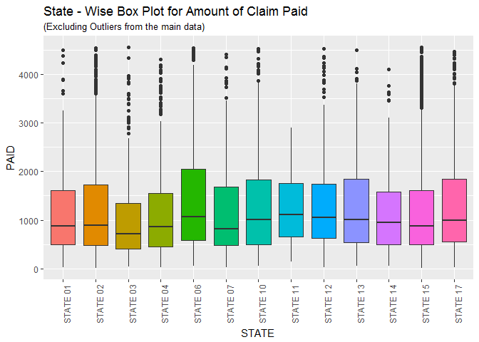

Automoblie Insurance Claim - EDA, Statistical Tests and Model Fitting
================
Pulkit Sikri

About the data
--------------

Claims experience from a large midwestern (US) property and casualty insurer for private passenger automobile insurance. The dependent variable is the amount paid on a closed claim, in (US) dollars (claims that were not closed by year end are handled separately). Insurers categorize policyholders according to a risk classification system. This insurer's risk classification system is based on automobile operator characteristics and ve- hicle characteristics, and these factors are summarized by the risk class categorical variable CLASS.

### Variables

-   STATE - Codes 01 to 17 used, with each code randomly assigned to an actual individual state
-   CLASS - Rating class of operator, based on age, gender, marital status, use of vehicle, as coded in a separate PDF file
-   GENDER
-   AGE
-   PAID - Amount paid to settle and close a claim

Source: <http://instruction.bus.wisc.edu/jfrees/jfreesbooks/Regression%20Modeling/BookWebDec2010/data.html>

``` r
auto.claims = read.csv('C:\\Users\\Administrator\\Desktop\\practice\\AutoClaims.csv')

library(dplyr)
library(ggplot2)
library(corrplot)
library(reshape2)
library(xgboost)
library(caTools)
```
### Let us take a glance at our dataset.

``` r
head(auto.claims)
```

    ##      STATE CLASS GENDER AGE    PAID
    ## 1 STATE 14   C6       M  97 1134.44
    ## 2 STATE 15   C6       M  96 3761.24
    ## 3 STATE 15   C11      M  95 7842.31
    ## 4 STATE 15   F6       F  95 2384.67
    ## 5 STATE 15   F6       M  95  650.00
    ## 6 STATE 15   F6       M  95  391.12

Univariate Analysis
-------------------

``` r
ggplot(auto.claims,aes(x=STATE,fill = STATE))+
  geom_bar()+
  theme(axis.text.x = element_text(angle = 90))+
  labs(title = "State wise count")
```


``` r
ggplot(auto.claims,aes(x=CLASS,fill = CLASS))+
  geom_bar()+
  theme(axis.text.x = element_text(angle = 90))+
  labs(title = "Class wise count")
```


``` r
gender = auto.claims %>% group_by(GENDER) %>% summarise(count = round(n()*100/nrow(auto.claims),2))
pie(gender$count,
    labels = c(paste("Females - ",gender$count[1],"%"),paste("Males - ",gender$count[2],"%")),
    main = "Males V/S Females",
    col = c("light pink","sky blue")
    )
```


``` r
auto.claims$agebin = cut(auto.claims$AGE,c(0,59,69,79,89,Inf),labels = c("50-59","60-69","70-79","80-89","90+"))

ggplot(auto.claims,aes(x=agebin,fill = agebin))+
  geom_bar()+
  labs(title="Age-bin wise count")
```


``` r
ggplot(auto.claims,aes(x="Claim",y=PAID))+
  geom_boxplot()+
  labs(title= "Box-Plot of Claim Paid")
```


From the above boxplot we can see that the there are a lot of outliers for the amount of claim paid, let's see how it looks like after remvoing the outliers

``` r
outlier.limit = quantile(auto.claims$PAID,probs = 0.75)+1.5*IQR(auto.claims$PAID)

ggplot(auto.claims,aes(x=PAID))+
  geom_histogram(bins = 15,fill = "purple",col = "black")+
  scale_x_continuous(limits = c(0,outlier.limit))+
  theme_dark()
```

    ## Warning: Removed 586 rows containing non-finite values (stat_bin).


We observe that Amount of claim is right-skewed

``` r
qqnorm(auto.claims$PAID)
```


Looking the histogram and the QQ-plot of amount of claim PAID, we can see that it is not normally distributed and is highly skewed. Therefore, we will use non-parametric tests in our further analysis.

Analysis with target variable PAID
----------------------------------

### STATE

``` r
ggplot(auto.claims,aes(x=STATE,y=PAID,fill = STATE))+
  geom_boxplot(show.legend = F)+
  scale_y_continuous(limits = c(0,outlier.limit))+
  theme(axis.text.x = element_text(angle = 90,hjust = 1))+
  ggtitle(label = "State - Wise Box Plot for Amount of Claim Paid",subtitle = "(Excluding Outliers from the main data)")
```



We can observer that the amount of claim paid varies according to different States, let us now test statisticaly if these differences are significant.

``` r
kruskal.test(PAID ~ STATE,data = auto.claims)
```

    ## 
    ##  Kruskal-Wallis rank sum test
    ## 
    ## data:  PAID by STATE
    ## Kruskal-Wallis chi-squared = 57.798, df = 12, p-value = 5.67e-08

Since p-value is less than 0.05, we will reject our null hypothesis that Claims Paid do not differ according to different States and we'll further perform post-hoc

``` r
pairwise.wilcox.test.graph(auto.claims$PAID,auto.claims$STATE)
```


pairwise.wilcox.test.graph is a function that I created (refer Appendix for syntax). The red area denotes that, statisticaly there is a difference between the two coresspoding States. For example, State 06 differs from State 02,03 and 04 in terms of amount of claim Paid.

We, will follow the above procedure for each variable.

### CLASS

``` r
ggplot(auto.claims,aes(x=CLASS,y=PAID,fill = CLASS))+
  geom_boxplot(show.legend = F)+
  scale_y_continuous(limits = c(0,outlier.limit))+
  ggtitle(label = "CLASS - Wise Box Plot for Amount of Claim Paid",subtitle = "(Excluding Outliers from the main data)")
```

    ## Warning: Removed 586 rows containing non-finite values (stat_boxplot).


``` r
kruskal.test(PAID ~ CLASS,data = auto.claims)
```

    ## 
    ##  Kruskal-Wallis rank sum test
    ## 
    ## data:  PAID by CLASS
    ## Kruskal-Wallis chi-squared = 35.669, df = 17, p-value = 0.005077

Since, the p-value is 0.05, it is worth performing a post hoc just to make sure if any two Classes differ wrt Amount of claim paid

``` r
pairwise.wilcox.test.graph(auto.claims$PAID,auto.claims$CLASS)
```


We, observe that class F7 and C7C differ significantly wrt Amount of claim Paid.

### GENDER

``` r
ggplot(auto.claims,aes(x=GENDER,y=PAID,fill = GENDER))+
  geom_boxplot()+
  scale_y_continuous(limits = c(0,outlier.limit))+
  theme(axis.text.x = element_text(angle = 90,hjust = 1))+
  ggtitle(label = "GENDER - Wise Box Plot for Amount of Claim Paid",subtitle = "(Excluding Outliers from the main data)")
```

    ## Warning: Removed 586 rows containing non-finite values (stat_boxplot).


``` r
kruskal.test(PAID ~ GENDER,data = auto.claims)
```

    ## 
    ##  Kruskal-Wallis rank sum test
    ## 
    ## data:  PAID by GENDER
    ## Kruskal-Wallis chi-squared = 2.9465, df = 1, p-value = 0.08607

Since p-value is more than 0.05, we fail to reject our null hypothesis that Claims Paid do not differ according to Gender

### AGE

``` r
ggplot(auto.claims,aes(x=AGE,y=PAID))+
  geom_point()+
  geom_smooth()
```

    ## `geom_smooth()` using method = 'gam'


We can see that the amount of claim paid is almost evenly distributed among different ages. Now, can use age bins which will help us analyse age with amount of claim paid even more.

### Age-bin

``` r
auto.claims %>% group_by(agebin) %>% summarise(median.paid = median(PAID)) %>%
  ggplot(aes(x=agebin,y=median.paid,fill = agebin))+
  geom_bar(stat = 'identity')
```


``` r
kruskal.test(PAID ~ agebin,data = auto.claims)
```

    ## 
    ##  Kruskal-Wallis rank sum test
    ## 
    ## data:  PAID by agebin
    ## Kruskal-Wallis chi-squared = 20.157, df = 4, p-value = 0.000465

Since p-value is less than 0.05, we reject our null hypothesis that Claims Paid do not differ according to age.

``` r
pairwise.wilcox.test.graph(auto.claims$PAID,auto.claims$agebin)
```


Outlier Analysis
----------------

Since our data has a lot of outliers in our target variable, it is worth analysing how the outliers are distributed among each independent variable.

First, let us look at the percentage of total outliers in our target variable.

    ## We have 8.65 %  of outliers in our targer variable (PAID)

### STATE

``` r
auto.claims %>% group_by(STATE) %>% summarise(n.outliers = length(which(PAID > outlier.limit)),count = n()) %>% 
  ggplot() +
  geom_bar(aes(x=reorder(STATE,-n.outliers),y=count),stat = 'identity',fill =
             'white',col='black')+
  geom_bar(aes(x=STATE,y=n.outliers),stat = 'identity',fill= "red",col = "black")+
  geom_text(aes(x=STATE,y=count,label = round(n.outliers*100/count,2)),stat =
              "identity",vjust=-0.2)+
  theme_grey()+
  theme(axis.text.x = element_text(angle = 90,hjust = 1))+
  ggtitle(label = "State wise Claim Amount outlier analysis")+
  xlab(label = "STATE")
```


Now, the above graph has a lot of information, which can be easily understood.

-   Each bar is the total count in each state.
-   The red bar inside the white bar is the number of outliers in each state.
-   The number on the top of each bar is the percentage of outliers in each state.
-   Also the States has been re-ordered according in decreasing order of number of outliers.

From the above graph, we can see that even though, the max number of outliers are from STATE 15, but the maximum percentage of outliers is ffrom STATE 12.

We, will make a similar graph for each variable.

### CLASS

``` r
auto.claims %>% group_by(CLASS) %>% summarise(n.outliers = length(which(PAID > outlier.limit)),count = n()) %>% 
  ggplot() +
  geom_bar(aes(x=reorder(CLASS,-n.outliers),y=count),stat = 'identity',fill =
             'white',col='black')+
  geom_bar(aes(x=CLASS,y=n.outliers),stat = 'identity',fill= "red",col = "black")+
  geom_text(aes(x=CLASS,y=count,label = round(n.outliers*100/count,2)),stat =
              "identity",vjust=-0.2)+
  theme_grey()+
  theme(axis.text.x = element_text(angle = 90,hjust = 1))+
  ggtitle(label = "CLASS wise Claim Amount outlier analysis")+
  xlab(label = "CLASS")
```


CLASS C72 stands at 8th position in total number of outliers, but it has the highest percentage of outliers in CLASS. Also, CLASS F7 has no outliers.

GENDER
------

``` r
auto.claims %>% group_by(GENDER) %>% summarise(n.outliers = length(which(PAID > outlier.limit)),count = n()) %>% 
  ggplot() +
  geom_bar(aes(x=reorder(GENDER,-n.outliers),y=count),stat = 'identity',fill =
             'white',col='black')+
  geom_bar(aes(x=GENDER,y=n.outliers),stat = 'identity',fill= "red",col = "black")+
  geom_text(aes(x=GENDER,y=count,label = round(n.outliers*100/count,2)),stat =
              "identity",vjust=-0.2)+
  theme_grey()+
  theme(axis.text.x = element_text(angle = 90,hjust = 1))+
  ggtitle(label = "GENDER wise Claim Amount outlier analysis")+
  xlab(label = "GENDER")
```


Even though we the count of Males is more, the outlier percentage is almost equal for both the Genders.

Age-bin
-------

``` r
auto.claims %>% group_by(agebin) %>% summarise(n.outliers = length(which(PAID > outlier.limit)),count = n()) %>% 
  ggplot() +
  geom_bar(aes(x=reorder(agebin,-n.outliers),y=count),stat = 'identity',fill =
             'white',col='black')+
  geom_bar(aes(x=agebin,y=n.outliers),stat = 'identity',fill= "red",col = "black")+
  geom_text(aes(x=agebin,y=count,label = round(n.outliers*100/count,2)),stat =
              "identity",vjust=-0.2)+
  theme_grey()
```


Even though, the count for the age group 90+ is least. It has the highest percentage of outliers.

STATE + CLASS
-------------

``` r
auto.claims %>% group_by(STATE,CLASS) %>% summarise(perc.outliers =length(which(PAID > outlier.limit))*100/n()) %>%
  ggplot(aes(x=STATE,y=CLASS,fill=perc.outliers))+
  geom_tile(col="black")+
  scale_fill_gradient(low="white",high="dark orange")+
  theme_classic()+
  theme(axis.text.x = element_text(angle = 90))+
  ggtitle(label = "STATE+ CLASS wise percentage of Claim Amount outliers" )
```


The outliers are not evenly distributed among States and Class taken together. We can see that Classes have different number of outliers according to different STATE.

STATE + GENDER
--------------

``` r
auto.claims %>% group_by(STATE,GENDER) %>% summarise(perc.outliers =length(which(PAID > outlier.limit))*100/n()) %>%
  ggplot(aes(x=STATE,y=GENDER,fill=perc.outliers))+
  geom_tile(col="black")+
  scale_fill_gradient(low="white",high="dark orange")+
  theme_classic()+
  theme(axis.text.x = element_text(angle = 90))+
   ggtitle(label = "STATE+ GENDER wise percentage of Claim Amount outliers" )
```


Females of STATE 11 has both the highest number of outliers and Males of the same STATE has the lowest number of outliers.

STATE + agebin
--------------

``` r
auto.claims %>% group_by(STATE,agebin) %>% summarise(perc.outliers =length(which(PAID > outlier.limit))*100/n()) %>%
  ggplot(aes(x=STATE,y=agebin,fill=perc.outliers))+
  geom_tile(col="black")+
  scale_fill_gradient(low="white",high="dark orange")+
  theme_classic()+
  theme(axis.text.x = element_text(angle = 90))+
  ggtitle(label = "STATE+ agebin wise percentage of Claim Amount outliers" )
```


From the above and the previous heat map, we observer that Females with age between 80-89 who are from STATE 11 have higher percentage of outliers.

CLASS + GENDER
--------------

``` r
auto.claims %>% group_by(CLASS,GENDER) %>% summarise(perc.outliers =length(which(PAID > outlier.limit))*100/n()) %>%
  ggplot(aes(x=CLASS,y=GENDER,fill=perc.outliers))+
  geom_tile(col="black")+
  scale_fill_gradient(low="white",high="dark orange")+
  theme_classic()+
  theme(axis.text.x = element_text(angle = 90))+
  ggtitle(label = "CLASS + GENDER wise percentage of Claim Amount outliers" )
```


CLASS + AGE
-----------

``` r
auto.claims %>% group_by(CLASS,agebin) %>% summarise(perc.outliers =length(which(PAID > outlier.limit))*100/n()) %>%
  ggplot(aes(x=agebin,y=CLASS,fill=perc.outliers))+
  geom_tile(col="black")+
  scale_fill_gradient(low="white",high="dark orange")+
  theme_classic()+
  theme(axis.text.x = element_text(angle = 90))+
  ggtitle(label = "CLASS + AGE BIN wise percentage of Claim Amount outliers" )
```


GENDER + AGE
------------

``` r
auto.claims %>% group_by(GENDER,agebin) %>% summarise(perc.outliers =length(which(PAID > outlier.limit))*100/n()) %>%
  ggplot(aes(x=GENDER,y=agebin,fill=perc.outliers))+
  geom_tile(col="black")+
  scale_fill_gradient(low="white",high="dark orange")+
  theme_classic()+
  theme(axis.text.x = element_text(angle = 90))+
  ggtitle(label = "GENDER + AGE BIN wise percentage of Claim Amount outliers" )
```


Females in age group 90+ have high percentage of Claim Amount outliers,while Males in age group 70-79 have a lower percentage of Claim Amount outliers

Multivariate Analysis.
----------------------

``` r
auto.claims %>% group_by(STATE,CLASS) %>% summarise(count = n(),median = median(PAID)) %>%
  ggplot(aes(x=STATE,y=CLASS,fill=count))+
  geom_tile(col="black")+
  scale_fill_gradient(low="sky blue",high="purple")+
  theme(axis.text.x = element_text(angle = 90))+
  ggtitle(label = "State + Class wise count")
```


The CLASS wise data according to each STATE looks evenly distributed for majority of STATES, The noticiable States are State 11 which does not contain more than half of the Classes, and State 15 which has an uneven distribution of classes

``` r
auto.claims %>% group_by(STATE,CLASS) %>% summarise(median = median(PAID)) %>%
  ggplot(aes(x=STATE,y=CLASS,fill=median))+
  geom_tile(col="black")+
  scale_fill_gradient(low="white",high="red")+
  theme(axis.text.x = element_text(angle = 90))+
  ggtitle(label = "State + Class wise median Amount of claim paid")
```


The class F6 from State06 has the highest median Amount of claim PAID

``` r
auto.claims %>% group_by(STATE,CLASS) %>% summarise(m2fratio = length(which(GENDER == 'M'))/length(which(GENDER=='F'))) %>%
  ggplot(aes(x=STATE,y=CLASS,fill = m2fratio))+
  geom_tile(col = "black")+
  scale_fill_gradient(low = "white",high="orange")+
  theme(axis.text.x = element_text(angle = 90))+
  ggtitle(label = "STATE + CLASS wise Male to female ratio" )
```


The complete white area dipicts there are no males in the intersection of STATE and CLASS and the grey Area shows there are no females. One interesting observation is that in STATE 11 we have either Only Males or Only Females according to different Classes

``` r
auto.claims %>% group_by(STATE,GENDER) %>% summarise(count = n(),Median.paid = median(PAID)) %>%
  ggplot(aes(x=STATE,y=GENDER,col= Median.paid))+
  geom_point(aes(size = count))+
  scale_colour_gradient(low="sky blue",high="purple")+
  scale_size(range = c(5,15))+
  theme_minimal()+
  theme(axis.text.x = element_text(angle = 90))+
  ggtitle(label = "STATE + GENDER wise count and Median of Claim Amount Paid")
```


The size of the point dipicts the count of Gender according to different States. The colour of the point dipicts the Median of Claim amount Paid.

We can see that the gender ratio is almost equal amongst the States

``` r
ggplot(auto.claims[auto.claims$PAID<outlier.limit,])+
  geom_point(aes(x=AGE,y=PAID,col = STATE),show.legend = F)+
  facet_wrap(~STATE)+
  ggtitle(label = "Age wise spread of Amount of Claim paid in each state",subtitle = "(Excluding outliers)")
```


``` r
auto.claims %>% group_by(STATE,agebin) %>% summarise(count = n(),median.paid = median(PAID)) %>%
  ggplot(aes(x=STATE,y=agebin,col= median.paid))+
  geom_point(aes(size = count))+
  scale_colour_gradient(low="sky blue",high="purple")+
  scale_size(range = c(5,15))+
  theme_minimal()+
  theme(axis.text.x = element_text(angle = 90))+
   ggtitle(label = "STATE + age wise count and Median of Claim Amount Paid")
```


The size of the point dipicts the count of different according to different States. The colour of the point dipicts the Median of Claim amount Paid.

We can see that in each State the age group 50-59 has the highest count and the count decreases as the age increases and The Median Amount of claim paid is similar for each agebin amongst different STATE.

``` r
  auto.claims %>% group_by(CLASS,GENDER) %>% summarise(median.paid = median(PAID)) %>%
  ggplot(aes(x=CLASS,y=GENDER,fill = median.paid))+
  geom_tile()+
  scale_fill_continuous(low = 'yellow',high = 'purple')+
  ggtitle(label = "CLASS + GENDER wise Median of Claim Amount Paid")
```


``` r
ggplot(auto.claims[auto.claims$PAID<outlier.limit,])+
  geom_point(aes(x=AGE,y=PAID,col = CLASS),show.legend = F)+
  facet_wrap(~CLASS)+
   ggtitle(label = "Age wise spread of Amount of Claim paid in each CLASS",subtitle = "(Excluding outliers)")
```


We see that most of the Classes have a very specific age group for example Class F6 does not have any observation below the age 70, similar observations can be made about other classes as well. It is worth looking at the box plot of age according to different Classes

``` r
ggplot(auto.claims,aes(x=CLASS,y=AGE,fill = CLASS))+
  geom_boxplot(show.legend = F)+
  ggtitle("Class wise Boxplot of age")
```


We observe that different classes have different spread of age groups.

``` r
ggplot(auto.claims,aes(x=GENDER,y=AGE,fill = GENDER))+
  geom_boxplot()
```


We observe that both the Genders have similar spread of age groups

``` r
auto.claims %>% group_by(GENDER,agebin) %>% summarise(median.paid = median(PAID)) %>%
  ggplot(aes(x=GENDER,y=agebin,fill= median.paid))+
  geom_tile()+
  scale_fill_continuous(low = 'yellow',high = 'purple')+
  ggtitle("GENDER + Age wise Median of Claim Amount Paid")
```


Females in the age group 90+ have higher Median of Claim Amount Paid

### Other Analysis

``` r
auto.claims%>% group_by(STATE,CLASS) %>% summarise(avg.age = mean(AGE)) %>% 
  ggplot(aes(x=STATE,y=CLASS,fill= avg.age))+
  geom_tile()+
  scale_fill_gradient(low="sky blue",high="purple")+
  theme(axis.text.x = element_text(angle = 90))+
  ggtitle("STATE + CLASS wise average Age")
```


``` r
ggplot(auto.claims)+
  geom_boxplot(aes(x=STATE,y=PAID,fill = STATE),show.legend = F)+
  facet_wrap(~GENDER)+
  theme(axis.text.x = element_text(angle = 90))+
  scale_y_continuous(limits = c(0,outlier.limit))+
  ggtitle("STATE wise boxpot of Claim Amount Paid wrt Gender",subtitle = "(Excluding outliers)")
```

    ## Warning: Removed 586 rows containing non-finite values (stat_boxplot).


``` r
ggplot(auto.claims)+
  geom_boxplot(aes(x=STATE,y=AGE,fill = STATE),show.legend = F)+
  facet_wrap(~GENDER)+
  theme(axis.text.x = element_text(angle = 90))+
  ggtitle("STATE wise boxpot of Age wrt Gender")
```


``` r
auto.claims %>% group_by(CLASS) %>% summarise(m2fratio = length(which(GENDER=='M'))/length(which(GENDER == 'F'))) %>% 
  ggplot()+
  geom_bar(aes(x=reorder(CLASS,-m2fratio),y=m2fratio,fill = CLASS),stat = 'identity',show.legend = F)+
  ggtitle("Class wise  male to female ratio")+
  xlab("CLASS")
```


``` r
ggplot(auto.claims,aes(x=CLASS,y=AGE,fill = CLASS))+
  geom_boxplot(show.legend = F)+
  facet_wrap(~GENDER)+
  theme(axis.text.x = element_text(angle = 90))+
  ggtitle("CLASS wise boxpot of Age wrt Gender")
```


``` r
auto.claims %>% group_by(agebin) %>% summarise(m2fratio = length(which(GENDER=='M'))/length(which(GENDER == 'F'))) %>% 
  ggplot()+
  geom_bar(aes(x=reorder(agebin,-m2fratio),y=m2fratio,fill = agebin),stat = 'identity',show.legend = F)+
   ggtitle("AGE wise  male to female ratio")+
  xlab("AGE")
```


Model fitting
-------------

Here we are using XGboost to train our model.

``` r
library(Matrix)
auto.claims <- auto.claims[-6]
sparse_matrix_full = sparse.model.matrix(PAID~.-1, data = auto.claims)
xgb_ds <- xgb.DMatrix(sparse_matrix_full,label = auto.claims$PAID)
 

params <- list(booster = "gbtree", objective = "reg:linear", eta= 0.01, gamma=1, max_depth=6, min_child_weight=2, subsample=0.8, colsample_bytree=0.75, eval_metric = 'rmse')

set.seed(123)
xgbcv <- xgb.cv(params = params, data = xgb_ds, nrounds = 1000, nfold = 3, showsd = T, stratified = T, maximize = F)
```

    ## [1]  train-rmse:3218.381754+80.654186    test-rmse:3216.172607+161.341806 
    ## [2]  train-rmse:3207.523681+80.871277    test-rmse:3205.883301+161.783815 
    ## [3]  train-rmse:3196.644938+80.900379    test-rmse:3195.693604+162.462277 
    ## [4]  train-rmse:3186.328369+81.011947    test-rmse:3185.639079+162.985754 
    ## [5]  train-rmse:3175.781901+81.155888    test-rmse:3175.808024+163.432456 
    ## [6]  train-rmse:3165.527344+81.155987    test-rmse:3166.205566+163.887892 
    ## [7]  train-rmse:3155.537191+81.110989    test-rmse:3156.694173+164.378820 
    ## [8]  train-rmse:3145.811768+81.136410    test-rmse:3147.358968+164.789240 
    ## [9]  train-rmse:3136.137939+81.113181    test-rmse:3138.118245+165.206686 
    ## [10] train-rmse:3126.104167+81.187183    test-rmse:3129.085205+165.664721 
    ## [11] train-rmse:3116.979167+81.557468    test-rmse:3120.336670+166.043833 
    ## [12] train-rmse:3108.189697+81.666950    test-rmse:3111.797282+166.464920 
    ## [13] train-rmse:3098.777344+81.825394    test-rmse:3103.243490+166.865129 
    ## [14] train-rmse:3089.822266+82.010729    test-rmse:3094.656494+167.381302 
    ## [15] train-rmse:3080.607340+82.013042    test-rmse:3086.501546+167.880152 
    ## [16] train-rmse:3071.902018+81.924153    test-rmse:3078.222494+168.368050 
    ## [17] train-rmse:3062.767008+82.007005    test-rmse:3070.176188+168.775163 
    ## [18] train-rmse:3054.373861+81.863993    test-rmse:3062.378988+169.178851 
    ## [19] train-rmse:3046.020264+81.650563    test-rmse:3054.526449+169.616141 
    ## [20] train-rmse:3037.969157+81.662717    test-rmse:3046.923665+169.868855 
    ## [21] train-rmse:3029.416829+81.481889    test-rmse:3039.563721+170.368448 
    ## [22] train-rmse:3021.353597+81.765472    test-rmse:3032.296875+170.630537 
    ## [23] train-rmse:3013.575358+81.916109    test-rmse:3025.027262+171.098806 
    ## [24] train-rmse:3005.658610+81.911112    test-rmse:3017.897298+171.525150 
    ## [25] train-rmse:2998.041097+82.171794    test-rmse:3011.117187+171.958136 
    ## [26] train-rmse:2990.193115+82.131131    test-rmse:3004.372965+172.251530 
    ## [27] train-rmse:2983.034098+82.385086    test-rmse:2997.667236+172.621827 
    ## [28] train-rmse:2975.920980+82.389807    test-rmse:2991.137777+173.009262 
    ## [29] train-rmse:2968.605794+82.452998    test-rmse:2984.681071+173.282142 
    ## [30] train-rmse:2961.633789+82.621577    test-rmse:2978.284424+173.512279 
    ## [31] train-rmse:2954.341878+82.392764    test-rmse:2972.155355+173.722742 
    ## [32] train-rmse:2947.566895+82.508985    test-rmse:2966.000244+173.994108 
    ## [33] train-rmse:2941.048584+82.668326    test-rmse:2959.954753+174.270153 
    ## [34] train-rmse:2934.402344+82.649788    test-rmse:2954.242431+174.597574 
    ## [35] train-rmse:2927.858887+82.973649    test-rmse:2948.499349+174.912891 
    ## [36] train-rmse:2921.043050+82.995120    test-rmse:2942.767822+175.207312 
    ## [37] train-rmse:2914.553548+83.374590    test-rmse:2937.219075+175.675573 
    ## [38] train-rmse:2908.213786+83.206486    test-rmse:2931.712646+175.898049 
    ## [39] train-rmse:2901.985189+83.278079    test-rmse:2926.232910+176.299959 
    ## [40] train-rmse:2895.865153+83.364564    test-rmse:2920.911051+176.678261 
    ## [41] train-rmse:2890.025960+83.574191    test-rmse:2915.782878+176.969138 
    ## [42] train-rmse:2884.230387+83.925983    test-rmse:2910.727946+177.325495 
    ## [43] train-rmse:2878.367106+83.935586    test-rmse:2905.938965+177.535208 
    ## [44] train-rmse:2872.752767+83.705678    test-rmse:2900.998291+177.805206 
    ## [45] train-rmse:2867.331624+84.167353    test-rmse:2896.159017+178.033030 
    ## [46] train-rmse:2861.795410+84.001170    test-rmse:2891.389404+178.328383 
    ## [47] train-rmse:2856.306641+83.984328    test-rmse:2886.719157+178.656699 
    ## [48] train-rmse:2851.151774+84.060716    test-rmse:2882.099446+178.838838 
    ## [49] train-rmse:2845.560059+84.232766    test-rmse:2877.700602+179.172616 
    ## [50] train-rmse:2840.661296+84.331533    test-rmse:2873.227214+179.391312 
    ## [51] train-rmse:2835.582519+84.678950    test-rmse:2868.946696+179.694127 
    ## [52] train-rmse:2830.593343+84.976451    test-rmse:2864.703450+180.000941 
    ## [53] train-rmse:2825.517090+85.238143    test-rmse:2860.613770+180.233173 
    ## [54] train-rmse:2820.370850+85.196192    test-rmse:2856.464681+180.512734 
    ## [55] train-rmse:2815.823161+85.314971    test-rmse:2852.457113+180.714313 
    ## [56] train-rmse:2810.795248+85.272610    test-rmse:2848.726481+180.808784 
    ## [57] train-rmse:2806.111409+85.639233    test-rmse:2844.930827+181.185053 
    ## [58] train-rmse:2801.467529+85.786282    test-rmse:2841.162598+181.448681 
    ## [59] train-rmse:2797.046468+85.716726    test-rmse:2837.552653+181.574383 
    ## [60] train-rmse:2792.734294+85.929509    test-rmse:2833.874349+181.799568 
    ## [61] train-rmse:2788.288981+85.721289    test-rmse:2830.330485+182.009589 
    ## [62] train-rmse:2784.220947+85.976814    test-rmse:2826.819580+182.318128 
    ## [63] train-rmse:2780.246663+86.108951    test-rmse:2823.436849+182.502520 
    ## [64] train-rmse:2776.124431+86.488913    test-rmse:2820.081299+182.689014 
    ## [65] train-rmse:2772.297445+86.689559    test-rmse:2816.716472+182.928521 
    ## [66] train-rmse:2767.950440+86.658589    test-rmse:2813.401042+183.228882 
    ## [67] train-rmse:2764.069906+86.557738    test-rmse:2810.331217+183.384023 
    ## [68] train-rmse:2760.063965+86.560102    test-rmse:2807.272380+183.489591 
    ## [69] train-rmse:2756.291504+86.744839    test-rmse:2804.303385+183.628160 
    ## [70] train-rmse:2752.480957+86.624834    test-rmse:2801.327230+183.794867 
    ## [71] train-rmse:2748.720703+86.661445    test-rmse:2798.355876+184.045348 
    ## [72] train-rmse:2744.925049+86.767328    test-rmse:2795.443522+184.353206 
    ## [73] train-rmse:2741.328044+87.028240    test-rmse:2792.629151+184.499072 
    ## [74] train-rmse:2737.946452+86.911072    test-rmse:2789.858805+184.542468 
    ## [75] train-rmse:2734.451009+87.129445    test-rmse:2787.222249+184.736867 
    ## [76] train-rmse:2731.352051+87.274055    test-rmse:2784.542562+184.998437 
    ## [77] train-rmse:2728.070150+87.260508    test-rmse:2781.819824+185.097195 
    ## [78] train-rmse:2724.770182+87.316116    test-rmse:2779.307292+185.188212 
    ## [79] train-rmse:2721.496419+86.940160    test-rmse:2776.760498+185.368561 
    ## [80] train-rmse:2718.353434+86.926448    test-rmse:2774.290934+185.487636 
    ## [81] train-rmse:2714.853597+86.619284    test-rmse:2771.925049+185.677317 
    ## [82] train-rmse:2711.879557+86.580504    test-rmse:2769.560710+185.810907 
    ## [83] train-rmse:2708.905762+86.746139    test-rmse:2767.353678+185.864463 
    ## [84] train-rmse:2706.036296+86.657868    test-rmse:2765.089437+185.946223 
    ## [85] train-rmse:2703.375570+86.892469    test-rmse:2762.775797+186.195738 
    ## [86] train-rmse:2700.421143+86.818987    test-rmse:2760.569417+186.312265 
    ## [87] train-rmse:2697.755452+86.608157    test-rmse:2758.439291+186.449142 
    ## [88] train-rmse:2695.072672+86.892925    test-rmse:2756.465251+186.560165 
    ## [89] train-rmse:2692.326090+86.791068    test-rmse:2754.347005+186.670990 
    ## [90] train-rmse:2689.543783+86.853601    test-rmse:2752.355876+186.760337 
    ## [91] train-rmse:2687.247315+87.063260    test-rmse:2750.361410+186.860172 
    ## [92] train-rmse:2684.656169+86.976117    test-rmse:2748.452149+186.965782 
    ## [93] train-rmse:2681.860026+87.125888    test-rmse:2746.501058+187.117970 
    ## [94] train-rmse:2679.388509+87.119703    test-rmse:2744.739013+187.293477 
    ## [95] train-rmse:2677.108642+87.224993    test-rmse:2742.996501+187.369242 
    ## [96] train-rmse:2674.562175+87.049682    test-rmse:2741.184408+187.515551 
    ## [97] train-rmse:2672.161296+86.915334    test-rmse:2739.380859+187.618122 
    ## [98] train-rmse:2669.399821+86.850481    test-rmse:2737.719645+187.617596 
    ## [99] train-rmse:2667.019368+86.764846    test-rmse:2736.087809+187.656794 
    ## [100]    train-rmse:2664.415446+86.446355    test-rmse:2734.645183+187.737176 
    ## [101]    train-rmse:2662.159342+86.437898    test-rmse:2733.117838+187.829136 
    ## [102]    train-rmse:2659.868001+86.236714    test-rmse:2731.621012+187.834531 
    ## [103]    train-rmse:2657.888753+86.234735    test-rmse:2729.987956+187.913756 
    ## [104]    train-rmse:2655.738037+86.308464    test-rmse:2728.496582+187.986128 
    ## [105]    train-rmse:2653.569824+86.183892    test-rmse:2727.006836+188.043801 
    ## [106]    train-rmse:2651.731852+86.452770    test-rmse:2725.527506+188.075471 
    ## [107]    train-rmse:2649.063802+86.212400    test-rmse:2724.228597+188.169941 
    ## [108]    train-rmse:2647.049967+86.089727    test-rmse:2722.901041+188.298175 
    ## [109]    train-rmse:2644.907552+85.954586    test-rmse:2721.571533+188.299151 
    ## [110]    train-rmse:2642.910237+85.987099    test-rmse:2720.267252+188.376482 
    ## [111]    train-rmse:2641.061279+86.227019    test-rmse:2718.990804+188.492376 
    ## [112]    train-rmse:2638.936849+86.213923    test-rmse:2717.782226+188.552672 
    ## [113]    train-rmse:2636.818441+85.988928    test-rmse:2716.440267+188.778662 
    ## [114]    train-rmse:2634.523926+85.876459    test-rmse:2715.263590+188.832034 
    ## [115]    train-rmse:2632.965088+85.875641    test-rmse:2714.059326+188.869084 
    ## [116]    train-rmse:2630.796143+85.594803    test-rmse:2712.986409+188.871771 
    ## [117]    train-rmse:2628.596436+85.545117    test-rmse:2711.888591+188.947607 
    ## [118]    train-rmse:2627.091309+85.660369    test-rmse:2710.775716+189.081908 
    ## [119]    train-rmse:2625.686442+85.740353    test-rmse:2709.641601+189.136842 
    ## [120]    train-rmse:2624.089111+85.985312    test-rmse:2708.568359+189.317403 
    ## [121]    train-rmse:2622.371908+86.169825    test-rmse:2707.547770+189.417751 
    ## [122]    train-rmse:2620.653564+86.259876    test-rmse:2706.544271+189.484780 
    ## [123]    train-rmse:2618.859375+86.206459    test-rmse:2705.537191+189.555298 
    ## [124]    train-rmse:2617.196045+85.915591    test-rmse:2704.716471+189.559593 
    ## [125]    train-rmse:2615.699951+86.146382    test-rmse:2703.668294+189.624096 
    ## [126]    train-rmse:2614.238362+86.005657    test-rmse:2702.683431+189.673720 
    ## [127]    train-rmse:2612.469727+85.873745    test-rmse:2701.920247+189.768431 
    ## [128]    train-rmse:2610.897624+85.839054    test-rmse:2701.124837+189.936195 
    ## [129]    train-rmse:2609.411702+85.744267    test-rmse:2700.272379+189.937107 
    ## [130]    train-rmse:2608.131917+85.864953    test-rmse:2699.346761+190.024649 
    ## [131]    train-rmse:2606.716390+86.059271    test-rmse:2698.543457+190.194578 
    ## [132]    train-rmse:2605.430420+86.029237    test-rmse:2697.679362+190.268716 
    ## [133]    train-rmse:2603.623128+85.715791    test-rmse:2697.046305+190.328243 
    ## [134]    train-rmse:2601.572591+85.710003    test-rmse:2696.428386+190.339763 
    ## [135]    train-rmse:2600.197917+85.774868    test-rmse:2695.721517+190.341011 
    ## [136]    train-rmse:2598.764811+85.648447    test-rmse:2694.899577+190.452395 
    ## [137]    train-rmse:2597.414632+85.775620    test-rmse:2694.277018+190.438530 
    ## [138]    train-rmse:2596.118490+85.554398    test-rmse:2693.558919+190.386360 
    ## [139]    train-rmse:2594.761800+85.486404    test-rmse:2692.910238+190.403254 
    ## [140]    train-rmse:2593.303711+85.334592    test-rmse:2692.257487+190.424620 
    ## [141]    train-rmse:2592.076579+85.518563    test-rmse:2691.685954+190.536842 
    ## [142]    train-rmse:2590.696208+85.287670    test-rmse:2691.048096+190.550592 
    ## [143]    train-rmse:2589.405111+85.103411    test-rmse:2690.505208+190.560011 
    ## [144]    train-rmse:2588.188883+85.367441    test-rmse:2689.972412+190.663211 
    ## [145]    train-rmse:2586.736735+84.995099    test-rmse:2689.426188+190.642029 
    ## [146]    train-rmse:2585.381429+85.059365    test-rmse:2689.006022+190.685015 
    ## [147]    train-rmse:2584.239909+84.917603    test-rmse:2688.394124+190.718784 
    ## [148]    train-rmse:2583.014567+84.787805    test-rmse:2687.823812+190.697505 
    ## [149]    train-rmse:2581.445719+85.006690    test-rmse:2687.427897+190.744043 
    ## [150]    train-rmse:2580.373535+84.863778    test-rmse:2686.961833+190.696232 
    ## [151]    train-rmse:2579.256022+84.918369    test-rmse:2686.500651+190.719968 
    ## [152]    train-rmse:2577.738281+84.547431    test-rmse:2686.000326+191.033634 
    ## [153]    train-rmse:2576.601318+84.420048    test-rmse:2685.502685+191.134529 
    ## [154]    train-rmse:2575.561605+84.590910    test-rmse:2685.076335+191.242889 
    ## [155]    train-rmse:2574.493408+84.692491    test-rmse:2684.569092+191.197326 
    ## [156]    train-rmse:2573.695150+84.710494    test-rmse:2684.109863+191.247743 
    ## [157]    train-rmse:2572.542074+84.605579    test-rmse:2683.642660+191.255652 
    ## [158]    train-rmse:2571.749512+84.583911    test-rmse:2683.123210+191.268447 
    ## [159]    train-rmse:2570.580322+84.658856    test-rmse:2682.746582+191.343641 
    ## [160]    train-rmse:2569.437744+84.486631    test-rmse:2682.410319+191.298985 
    ## [161]    train-rmse:2568.216553+84.419084    test-rmse:2682.135010+191.348874 
    ## [162]    train-rmse:2566.971110+83.850502    test-rmse:2681.789144+191.284246 
    ## [163]    train-rmse:2565.991374+83.773168    test-rmse:2681.470215+191.321593 
    ## [164]    train-rmse:2565.137125+83.638368    test-rmse:2681.113281+191.307894 
    ## [165]    train-rmse:2564.434652+83.639802    test-rmse:2680.745280+191.334471 
    ## [166]    train-rmse:2563.543620+83.363963    test-rmse:2680.361898+191.352152 
    ## [167]    train-rmse:2562.701497+83.603000    test-rmse:2680.092122+191.406372 
    ## [168]    train-rmse:2561.993571+83.642589    test-rmse:2679.682699+191.414483 
    ## [169]    train-rmse:2561.033284+83.484134    test-rmse:2679.446614+191.399212 
    ## [170]    train-rmse:2560.324381+83.329323    test-rmse:2679.053955+191.418373 
    ## [171]    train-rmse:2559.269124+83.380312    test-rmse:2678.711914+191.433475 
    ## [172]    train-rmse:2558.332845+83.265877    test-rmse:2678.541341+191.501342 
    ## [173]    train-rmse:2557.666992+83.272731    test-rmse:2678.245931+191.489093 
    ## [174]    train-rmse:2556.858236+83.388035    test-rmse:2678.046549+191.499326 
    ## [175]    train-rmse:2555.794271+83.221665    test-rmse:2677.665690+191.458302 
    ## [176]    train-rmse:2555.043294+83.312289    test-rmse:2677.277262+191.522662 
    ## [177]    train-rmse:2554.007812+83.207016    test-rmse:2677.067708+191.533902 
    ## [178]    train-rmse:2552.949219+83.320775    test-rmse:2676.835937+191.617563 
    ## [179]    train-rmse:2552.210287+83.444982    test-rmse:2676.508138+191.653813 
    ## [180]    train-rmse:2551.290039+83.645068    test-rmse:2676.195313+191.683514 
    ## [181]    train-rmse:2550.417562+83.544996    test-rmse:2675.992676+191.720465 
    ## [182]    train-rmse:2549.673991+83.395877    test-rmse:2675.670410+191.700899 
    ## [183]    train-rmse:2548.854574+83.452225    test-rmse:2675.309163+191.754046 
    ## [184]    train-rmse:2547.972087+83.475363    test-rmse:2675.087565+191.769796 
    ## [185]    train-rmse:2547.302653+83.294452    test-rmse:2674.818278+191.808127 
    ## [186]    train-rmse:2546.523275+83.115906    test-rmse:2674.661947+191.792551 
    ## [187]    train-rmse:2545.735270+83.096456    test-rmse:2674.613688+191.850860 
    ## [188]    train-rmse:2544.884440+83.160910    test-rmse:2674.471192+191.989939 
    ## [189]    train-rmse:2543.983561+82.782868    test-rmse:2674.352783+191.888388 
    ## [190]    train-rmse:2543.284098+82.871681    test-rmse:2674.166748+191.943508 
    ## [191]    train-rmse:2542.260091+82.575211    test-rmse:2673.986491+191.954197 
    ## [192]    train-rmse:2541.562500+82.524427    test-rmse:2673.829020+191.955142 
    ## [193]    train-rmse:2540.708089+82.589650    test-rmse:2673.647624+192.035332 
    ## [194]    train-rmse:2539.772379+82.582901    test-rmse:2673.477051+192.077758 
    ## [195]    train-rmse:2538.604085+82.322064    test-rmse:2673.469401+192.048118 
    ## [196]    train-rmse:2537.978190+82.157881    test-rmse:2673.263265+192.088649 
    ## [197]    train-rmse:2537.361979+82.042977    test-rmse:2673.098877+192.158761 
    ## [198]    train-rmse:2536.449870+82.099353    test-rmse:2673.096273+192.167261 
    ## [199]    train-rmse:2535.613119+82.014840    test-rmse:2673.043538+192.170563 
    ## [200]    train-rmse:2534.800700+81.925466    test-rmse:2672.993815+192.204443 
    ## [201]    train-rmse:2534.157959+81.786831    test-rmse:2672.931234+192.270972 
    ## [202]    train-rmse:2533.725016+81.901758    test-rmse:2672.734619+192.359159 
    ## [203]    train-rmse:2532.888997+81.797005    test-rmse:2672.799967+192.368374 
    ## [204]    train-rmse:2532.137614+81.575983    test-rmse:2672.772217+192.294969 
    ## [205]    train-rmse:2531.520833+81.411846    test-rmse:2672.580973+192.333192 
    ## [206]    train-rmse:2530.728353+81.124192    test-rmse:2672.554606+192.252660 
    ## [207]    train-rmse:2530.137044+80.933283    test-rmse:2672.548014+192.171716 
    ## [208]    train-rmse:2529.507812+81.045428    test-rmse:2672.473063+192.225557 
    ## [209]    train-rmse:2528.725342+80.968239    test-rmse:2672.501872+192.276014 
    ## [210]    train-rmse:2528.070150+80.797944    test-rmse:2672.437744+192.358804 
    ## [211]    train-rmse:2527.524495+80.978041    test-rmse:2672.379883+192.347806 
    ## [212]    train-rmse:2527.036947+80.955781    test-rmse:2672.347819+192.341616 
    ## [213]    train-rmse:2526.396077+81.099253    test-rmse:2672.357015+192.358436 
    ## [214]    train-rmse:2525.775472+81.150652    test-rmse:2672.496256+192.394684 
    ## [215]    train-rmse:2525.361247+81.165739    test-rmse:2672.412923+192.495299 
    ## [216]    train-rmse:2524.467448+81.233505    test-rmse:2672.517904+192.615514 
    ## [217]    train-rmse:2523.716552+81.065716    test-rmse:2672.535563+192.543230 
    ## [218]    train-rmse:2523.039876+81.076062    test-rmse:2672.567139+192.635457 
    ## [219]    train-rmse:2522.493896+80.938693    test-rmse:2672.444580+192.708823 
    ## [220]    train-rmse:2521.997965+81.064355    test-rmse:2672.432617+192.784164 
    ## [221]    train-rmse:2521.355550+81.232287    test-rmse:2672.514974+192.820562 
    ## [222]    train-rmse:2520.724447+81.231045    test-rmse:2672.361491+192.903134 
    ## [223]    train-rmse:2519.994466+81.094518    test-rmse:2672.347656+192.857589 
    ## [224]    train-rmse:2518.969157+80.864650    test-rmse:2672.404867+192.985091 
    ## [225]    train-rmse:2518.406901+80.541018    test-rmse:2672.402425+192.974339 
    ## [226]    train-rmse:2517.936279+80.317985    test-rmse:2672.474121+192.900208 
    ## [227]    train-rmse:2517.299967+79.872106    test-rmse:2672.519531+192.722301 
    ## [228]    train-rmse:2516.305583+79.975544    test-rmse:2672.698323+192.788570 
    ## [229]    train-rmse:2515.922852+79.794394    test-rmse:2672.633952+192.754040 
    ## [230]    train-rmse:2515.114909+79.744753    test-rmse:2672.766927+192.802482 
    ## [231]    train-rmse:2514.632975+79.883267    test-rmse:2672.846354+192.887704 
    ## [232]    train-rmse:2514.149414+79.937242    test-rmse:2672.784831+192.902414 
    ## [233]    train-rmse:2513.423177+80.010217    test-rmse:2672.857340+192.961087 
    ## [234]    train-rmse:2512.729329+80.247341    test-rmse:2673.039225+193.081194 
    ## [235]    train-rmse:2512.065023+80.420283    test-rmse:2673.038493+193.070000 
    ## [236]    train-rmse:2511.565999+80.602953    test-rmse:2673.012939+193.095190 
    ## [237]    train-rmse:2510.965088+80.831352    test-rmse:2672.948568+193.141408 
    ## [238]    train-rmse:2510.211182+80.862431    test-rmse:2672.980875+193.252660 
    ## [239]    train-rmse:2509.855062+80.911920    test-rmse:2672.981039+193.280612 
    ## [240]    train-rmse:2509.389730+80.572684    test-rmse:2672.947103+193.253843 
    ## [241]    train-rmse:2508.716309+80.605307    test-rmse:2672.971680+193.328659 
    ## [242]    train-rmse:2508.324870+80.538514    test-rmse:2673.063070+193.310120 
    ## [243]    train-rmse:2507.945394+80.364833    test-rmse:2673.012126+193.346601 
    ## [244]    train-rmse:2507.507731+80.264043    test-rmse:2673.031901+193.341129 
    ## [245]    train-rmse:2507.041422+80.415166    test-rmse:2673.254720+193.416096 
    ## [246]    train-rmse:2506.634277+80.314365    test-rmse:2673.258057+193.332763 
    ## [247]    train-rmse:2506.359538+80.309414    test-rmse:2673.282634+193.358454 
    ## [248]    train-rmse:2506.183106+80.368548    test-rmse:2673.254801+193.320877 
    ## [249]    train-rmse:2505.423747+80.057978    test-rmse:2673.386068+193.334838 
    ## [250]    train-rmse:2505.068359+80.187412    test-rmse:2673.484945+193.419414 
    ## [251]    train-rmse:2504.343017+79.975456    test-rmse:2673.646403+193.401028 
    ## [252]    train-rmse:2503.708334+79.872653    test-rmse:2673.789551+193.322225 
    ## [253]    train-rmse:2503.112712+79.960629    test-rmse:2674.007649+193.386152 
    ## [254]    train-rmse:2502.731934+79.954592    test-rmse:2674.199626+193.363854 
    ## [255]    train-rmse:2502.182780+79.997199    test-rmse:2674.142171+193.547551 
    ## [256]    train-rmse:2501.881104+79.881670    test-rmse:2674.085775+193.593426 
    ## [257]    train-rmse:2501.430420+79.889018    test-rmse:2674.110596+193.627665 
    ## [258]    train-rmse:2501.052978+79.795767    test-rmse:2674.148519+193.601395 
    ## [259]    train-rmse:2500.486165+79.673669    test-rmse:2674.337972+193.544145 
    ## [260]    train-rmse:2500.042155+79.588054    test-rmse:2674.395671+193.525331 
    ## [261]    train-rmse:2499.776530+79.679341    test-rmse:2674.325195+193.627497 
    ## [262]    train-rmse:2499.459310+79.679632    test-rmse:2674.244222+193.567116 
    ## [263]    train-rmse:2498.634766+79.214242    test-rmse:2674.363037+193.538280 
    ## [264]    train-rmse:2498.324219+79.124182    test-rmse:2674.425293+193.451876 
    ## [265]    train-rmse:2498.056234+79.212354    test-rmse:2674.291423+193.490823 
    ## [266]    train-rmse:2497.531087+78.801149    test-rmse:2674.302734+193.410261 
    ## [267]    train-rmse:2496.777669+78.370877    test-rmse:2674.487305+193.374250 
    ## [268]    train-rmse:2496.412679+78.408971    test-rmse:2674.429606+193.384399 
    ## [269]    train-rmse:2496.212647+78.302374    test-rmse:2674.419922+193.370298 
    ## [270]    train-rmse:2495.786947+78.339461    test-rmse:2674.600749+193.401755 
    ## [271]    train-rmse:2495.212158+78.547295    test-rmse:2674.694417+193.508581 
    ## [272]    train-rmse:2494.609700+78.342587    test-rmse:2674.869059+193.461074 
    ## [273]    train-rmse:2494.025635+78.539046    test-rmse:2675.139323+193.590917 
    ## [274]    train-rmse:2493.362060+78.271916    test-rmse:2675.326823+193.613602 
    ## [275]    train-rmse:2493.037191+78.247402    test-rmse:2675.392822+193.629000 
    ## [276]    train-rmse:2492.692139+78.349317    test-rmse:2675.604004+193.759002 
    ## [277]    train-rmse:2492.432129+78.478191    test-rmse:2675.659098+193.790628 
    ## [278]    train-rmse:2492.110840+78.284788    test-rmse:2675.659749+193.761038 
    ## [279]    train-rmse:2491.857992+78.262712    test-rmse:2675.729492+193.778628 
    ## [280]    train-rmse:2491.287679+78.063247    test-rmse:2676.041585+193.778607 
    ## [281]    train-rmse:2490.899251+78.107118    test-rmse:2676.237386+193.848566 
    ## [282]    train-rmse:2490.534017+77.939493    test-rmse:2676.238525+193.935602 
    ## [283]    train-rmse:2489.817139+77.904948    test-rmse:2676.523519+194.016942 
    ## [284]    train-rmse:2489.394857+78.049273    test-rmse:2676.526856+194.149720 
    ## [285]    train-rmse:2488.912028+77.806131    test-rmse:2676.646322+194.156676 
    ## [286]    train-rmse:2488.385254+77.781154    test-rmse:2676.683431+194.190287 
    ## [287]    train-rmse:2488.035238+77.846476    test-rmse:2676.838786+194.198710 
    ## [288]    train-rmse:2487.527507+77.898495    test-rmse:2676.949219+194.235242 
    ## [289]    train-rmse:2486.877767+77.487726    test-rmse:2677.071126+194.138400 
    ## [290]    train-rmse:2486.609457+77.359774    test-rmse:2677.212321+194.093466 
    ## [291]    train-rmse:2486.210612+77.289539    test-rmse:2677.317383+194.162882 
    ## [292]    train-rmse:2485.610840+77.313824    test-rmse:2677.492595+194.192061 
    ## [293]    train-rmse:2485.256511+77.160110    test-rmse:2677.539306+194.170425 
    ## [294]    train-rmse:2484.922607+77.274681    test-rmse:2677.595866+194.249330 
    ## [295]    train-rmse:2484.320638+77.058748    test-rmse:2677.768392+194.285268 
    ## [296]    train-rmse:2483.803792+77.307595    test-rmse:2677.974854+194.374595 
    ## [297]    train-rmse:2483.275879+77.367264    test-rmse:2677.976400+194.337585 
    ## [298]    train-rmse:2482.953450+77.547040    test-rmse:2677.907471+194.399091 
    ## [299]    train-rmse:2482.691650+77.506955    test-rmse:2677.935628+194.453475 
    ## [300]    train-rmse:2482.238851+77.491003    test-rmse:2678.243734+194.550805 
    ## [301]    train-rmse:2481.722656+77.390014    test-rmse:2678.422607+194.621871 
    ## [302]    train-rmse:2481.227539+77.050588    test-rmse:2678.649333+194.454147 
    ## [303]    train-rmse:2480.766032+76.746247    test-rmse:2678.657633+194.494361 
    ## [304]    train-rmse:2480.100911+76.547097    test-rmse:2678.789958+194.459928 
    ## [305]    train-rmse:2479.896077+76.558435    test-rmse:2678.831055+194.468486 
    ## [306]    train-rmse:2479.618978+76.482588    test-rmse:2678.912435+194.498588 
    ## [307]    train-rmse:2479.433919+76.596157    test-rmse:2678.965413+194.575324 
    ## [308]    train-rmse:2479.257243+76.583480    test-rmse:2678.896566+194.559946 
    ## [309]    train-rmse:2479.164551+76.558426    test-rmse:2678.884359+194.565706 
    ## [310]    train-rmse:2478.849447+76.568226    test-rmse:2679.044352+194.533222 
    ## [311]    train-rmse:2478.454508+76.567236    test-rmse:2679.134928+194.595423 
    ## [312]    train-rmse:2478.238281+76.723488    test-rmse:2679.129801+194.649146 
    ## [313]    train-rmse:2477.849935+76.790311    test-rmse:2679.095866+194.608540 
    ## [314]    train-rmse:2477.511719+76.857892    test-rmse:2679.213379+194.712322 
    ## [315]    train-rmse:2477.234213+76.851669    test-rmse:2679.378581+194.717438 
    ## [316]    train-rmse:2476.863281+76.891429    test-rmse:2679.494222+194.789185 
    ## [317]    train-rmse:2476.249105+76.688509    test-rmse:2679.482910+194.709950 
    ## [318]    train-rmse:2475.891683+76.796670    test-rmse:2679.464111+194.764398 
    ## [319]    train-rmse:2475.622803+76.721824    test-rmse:2679.558187+194.650742 
    ## [320]    train-rmse:2475.303955+76.455237    test-rmse:2679.608561+194.570325 
    ## [321]    train-rmse:2474.905518+76.196900    test-rmse:2679.777669+194.596315 
    ## [322]    train-rmse:2474.749349+76.202798    test-rmse:2679.777100+194.675803 
    ## [323]    train-rmse:2474.619873+76.244456    test-rmse:2679.809977+194.698125 
    ## [324]    train-rmse:2474.115967+76.237386    test-rmse:2679.984619+194.727697 
    ## [325]    train-rmse:2473.549723+76.012586    test-rmse:2680.165039+194.745399 
    ## [326]    train-rmse:2473.308187+75.909979    test-rmse:2680.334635+194.689681 
    ## [327]    train-rmse:2473.078776+75.947252    test-rmse:2680.401286+194.733258 
    ## [328]    train-rmse:2472.505127+75.590600    test-rmse:2680.679036+194.628352 
    ## [329]    train-rmse:2472.279704+75.442733    test-rmse:2680.749430+194.629696 
    ## [330]    train-rmse:2471.624756+75.320005    test-rmse:2680.981283+194.565046 
    ## [331]    train-rmse:2471.473226+75.339849    test-rmse:2681.104248+194.585853 
    ## [332]    train-rmse:2471.133382+75.146837    test-rmse:2681.129801+194.550602 
    ## [333]    train-rmse:2470.785482+75.204486    test-rmse:2681.247721+194.650894 
    ## [334]    train-rmse:2470.705322+75.243879    test-rmse:2681.245850+194.669517 
    ## [335]    train-rmse:2470.584228+75.212832    test-rmse:2681.302409+194.643551 
    ## [336]    train-rmse:2470.389160+75.370883    test-rmse:2681.394206+194.727525 
    ## [337]    train-rmse:2469.789714+75.572865    test-rmse:2681.780030+194.844038 
    ## [338]    train-rmse:2469.527262+75.727921    test-rmse:2681.961426+194.966183 
    ## [339]    train-rmse:2468.932943+75.512229    test-rmse:2682.173747+194.972192 
    ## [340]    train-rmse:2468.640625+75.316442    test-rmse:2682.234945+194.967225 
    ## [341]    train-rmse:2468.280925+75.370082    test-rmse:2682.386149+195.086976 
    ## [342]    train-rmse:2468.175781+75.390181    test-rmse:2682.382568+195.036850 
    ## [343]    train-rmse:2467.916911+75.530579    test-rmse:2682.386800+195.003917 
    ## [344]    train-rmse:2467.387207+75.365566    test-rmse:2682.771484+195.045050 
    ## [345]    train-rmse:2466.821370+75.420979    test-rmse:2682.995198+195.003842 
    ## [346]    train-rmse:2466.398844+75.426215    test-rmse:2683.121175+195.127850 
    ## [347]    train-rmse:2466.072510+75.123051    test-rmse:2683.145915+195.019849 
    ## [348]    train-rmse:2465.727702+75.169117    test-rmse:2683.302409+195.115037 
    ## [349]    train-rmse:2465.358398+75.206315    test-rmse:2683.521810+195.144950 
    ## [350]    train-rmse:2465.020182+75.290953    test-rmse:2683.535889+195.121335 
    ## [351]    train-rmse:2464.500000+75.255527    test-rmse:2683.764811+195.142383 
    ## [352]    train-rmse:2463.719971+75.146732    test-rmse:2683.857910+195.102466 
    ## [353]    train-rmse:2463.304281+75.257577    test-rmse:2683.968587+195.052867 
    ## [354]    train-rmse:2462.820150+75.012082    test-rmse:2684.094076+195.036379 
    ## [355]    train-rmse:2462.625488+75.027009    test-rmse:2684.291422+195.052549 
    ## [356]    train-rmse:2462.444173+75.000949    test-rmse:2684.405924+195.087229 
    ## [357]    train-rmse:2462.154297+74.954567    test-rmse:2684.598470+195.113412 
    ## [358]    train-rmse:2461.769694+74.999922    test-rmse:2684.805176+195.183990 
    ## [359]    train-rmse:2461.498291+74.971626    test-rmse:2684.747396+195.169514 
    ## [360]    train-rmse:2461.036703+74.792529    test-rmse:2684.872884+195.141126 
    ## [361]    train-rmse:2460.832113+74.852581    test-rmse:2684.983724+195.126657 
    ## [362]    train-rmse:2460.645264+74.775929    test-rmse:2684.939616+195.101300 
    ## [363]    train-rmse:2460.255046+74.622228    test-rmse:2685.150472+195.119621 
    ## [364]    train-rmse:2459.860270+74.524675    test-rmse:2685.307373+195.135284 
    ## [365]    train-rmse:2459.647217+74.644315    test-rmse:2685.384196+195.163375 
    ## [366]    train-rmse:2459.110840+74.476946    test-rmse:2685.573731+195.000915 
    ## [367]    train-rmse:2458.818685+74.488047    test-rmse:2685.727132+195.083420 
    ## [368]    train-rmse:2458.429199+74.511221    test-rmse:2686.018880+195.123821 
    ## [369]    train-rmse:2458.195475+74.366119    test-rmse:2686.141195+195.173904 
    ## [370]    train-rmse:2457.909180+74.275904    test-rmse:2686.287516+195.211876 
    ## [371]    train-rmse:2457.761881+74.266647    test-rmse:2686.307699+195.232371 
    ## [372]    train-rmse:2457.487061+74.094230    test-rmse:2686.402832+195.212938 
    ## [373]    train-rmse:2457.173828+73.797941    test-rmse:2686.483724+195.171013 
    ## [374]    train-rmse:2457.030843+73.796806    test-rmse:2686.457031+195.139128 
    ## [375]    train-rmse:2456.572835+73.598272    test-rmse:2686.481120+195.099792 
    ## [376]    train-rmse:2456.194173+73.557643    test-rmse:2686.470215+195.076009 
    ## [377]    train-rmse:2455.943929+73.599922    test-rmse:2686.671305+195.190215 
    ## [378]    train-rmse:2455.594401+73.850818    test-rmse:2686.812337+195.229281 
    ## [379]    train-rmse:2454.983887+73.788283    test-rmse:2686.893067+195.206454 
    ## [380]    train-rmse:2454.421305+73.642180    test-rmse:2687.024984+195.199347 
    ## [381]    train-rmse:2454.173910+73.527736    test-rmse:2687.175537+195.214591 
    ## [382]    train-rmse:2453.906983+73.242539    test-rmse:2687.292806+195.149223 
    ## [383]    train-rmse:2453.255209+73.152188    test-rmse:2687.311524+195.137655 
    ## [384]    train-rmse:2452.940104+73.235147    test-rmse:2687.405517+195.148954 
    ## [385]    train-rmse:2452.450602+73.213868    test-rmse:2687.630371+195.201933 
    ## [386]    train-rmse:2451.954264+73.252098    test-rmse:2687.871501+195.188190 
    ## [387]    train-rmse:2451.681966+73.245319    test-rmse:2688.025960+195.250135 
    ## [388]    train-rmse:2451.379801+73.146961    test-rmse:2688.229411+195.289577 
    ## [389]    train-rmse:2451.215251+73.072405    test-rmse:2688.328288+195.272283 
    ## [390]    train-rmse:2450.840169+73.114169    test-rmse:2688.421631+195.449897 
    ## [391]    train-rmse:2450.433024+73.180341    test-rmse:2688.682373+195.558243 
    ## [392]    train-rmse:2450.043701+73.402212    test-rmse:2688.984212+195.639810 
    ## [393]    train-rmse:2449.591471+73.175454    test-rmse:2689.197754+195.551804 
    ## [394]    train-rmse:2449.145752+73.166655    test-rmse:2689.405355+195.596001 
    ## [395]    train-rmse:2448.970622+73.117493    test-rmse:2689.425781+195.577778 
    ## [396]    train-rmse:2448.549072+73.125487    test-rmse:2689.645915+195.580917 
    ## [397]    train-rmse:2448.340006+73.056910    test-rmse:2689.838460+195.606227 
    ## [398]    train-rmse:2447.995931+72.992308    test-rmse:2689.818929+195.639046 
    ## [399]    train-rmse:2447.728841+72.977046    test-rmse:2689.885417+195.626179 
    ## [400]    train-rmse:2447.459636+72.928559    test-rmse:2689.960286+195.558979 
    ## [401]    train-rmse:2447.093506+72.774717    test-rmse:2690.184896+195.421828 
    ## [402]    train-rmse:2446.995606+72.810028    test-rmse:2690.219889+195.450678 
    ## [403]    train-rmse:2446.610189+72.605969    test-rmse:2690.416178+195.503365 
    ## [404]    train-rmse:2446.296387+72.614962    test-rmse:2690.510091+195.599623 
    ## [405]    train-rmse:2446.087972+72.649178    test-rmse:2690.524658+195.581278 
    ## [406]    train-rmse:2445.830404+72.507555    test-rmse:2690.570394+195.538465 
    ## [407]    train-rmse:2445.467774+72.665426    test-rmse:2690.925619+195.642269 
    ## [408]    train-rmse:2445.005453+72.669981    test-rmse:2691.175049+195.733134 
    ## [409]    train-rmse:2444.553060+72.772188    test-rmse:2691.255697+195.811971 
    ## [410]    train-rmse:2444.378499+72.893720    test-rmse:2691.330404+195.831166 
    ## [411]    train-rmse:2444.192708+72.990058    test-rmse:2691.446615+195.809834 
    ## [412]    train-rmse:2443.728923+73.017497    test-rmse:2691.603841+195.820447 
    ## [413]    train-rmse:2443.653646+73.028313    test-rmse:2691.670736+195.884741 
    ## [414]    train-rmse:2443.329834+73.006886    test-rmse:2691.822347+195.903277 
    ## [415]    train-rmse:2443.205160+73.022787    test-rmse:2691.940837+195.899520 
    ## [416]    train-rmse:2442.955648+73.022359    test-rmse:2691.927653+195.932902 
    ## [417]    train-rmse:2442.707845+73.093152    test-rmse:2691.970540+196.053237 
    ## [418]    train-rmse:2442.297282+72.966206    test-rmse:2692.116699+196.078358 
    ## [419]    train-rmse:2441.981527+72.976718    test-rmse:2692.122640+196.062315 
    ## [420]    train-rmse:2441.427572+73.041812    test-rmse:2692.140544+195.958496 
    ## [421]    train-rmse:2441.075928+73.043021    test-rmse:2692.333252+196.040789 
    ## [422]    train-rmse:2440.536947+72.879287    test-rmse:2692.531006+195.936333 
    ## [423]    train-rmse:2440.009115+72.644768    test-rmse:2692.785156+195.932227 
    ## [424]    train-rmse:2439.725749+72.599545    test-rmse:2692.962565+195.929851 
    ## [425]    train-rmse:2439.557617+72.608578    test-rmse:2693.075683+195.989350 
    ## [426]    train-rmse:2439.440837+72.655324    test-rmse:2692.917317+195.962577 
    ## [427]    train-rmse:2438.993327+72.546399    test-rmse:2692.759440+195.957653 
    ## [428]    train-rmse:2438.697998+72.672503    test-rmse:2692.796712+195.980502 
    ## [429]    train-rmse:2438.634277+72.656818    test-rmse:2692.787516+195.969987 
    ## [430]    train-rmse:2438.202230+72.419878    test-rmse:2692.870931+196.018199 
    ## [431]    train-rmse:2437.766032+72.151226    test-rmse:2693.089030+196.015967 
    ## [432]    train-rmse:2437.088216+71.813789    test-rmse:2693.265869+195.926540 
    ## [433]    train-rmse:2437.036621+71.861889    test-rmse:2693.342855+195.938040 
    ## [434]    train-rmse:2436.858642+71.882844    test-rmse:2693.525716+195.976399 
    ## [435]    train-rmse:2436.599446+71.682053    test-rmse:2693.623617+195.833697 
    ## [436]    train-rmse:2436.153239+71.601744    test-rmse:2693.886719+195.864827 
    ## [437]    train-rmse:2436.064290+71.622386    test-rmse:2693.904704+195.923650 
    ## [438]    train-rmse:2435.759847+71.580847    test-rmse:2693.976888+196.023896 
    ## [439]    train-rmse:2435.198324+71.382032    test-rmse:2694.011881+195.838480 
    ## [440]    train-rmse:2434.974609+71.449699    test-rmse:2694.065511+195.874505 
    ## [441]    train-rmse:2434.665690+71.345238    test-rmse:2694.134277+195.857699 
    ## [442]    train-rmse:2434.081706+71.231447    test-rmse:2694.253825+195.771465 
    ## [443]    train-rmse:2433.818115+71.150915    test-rmse:2694.221517+195.771838 
    ## [444]    train-rmse:2433.447673+71.147409    test-rmse:2694.458252+195.770039 
    ## [445]    train-rmse:2433.162353+70.961225    test-rmse:2694.601074+195.737785 
    ## [446]    train-rmse:2432.786458+70.883594    test-rmse:2694.811524+195.819566 
    ## [447]    train-rmse:2432.623779+70.786641    test-rmse:2694.914063+195.881537 
    ## [448]    train-rmse:2432.239665+70.470943    test-rmse:2694.875407+195.912009 
    ## [449]    train-rmse:2431.958984+70.344274    test-rmse:2694.933512+195.944021 
    ## [450]    train-rmse:2431.761882+70.310754    test-rmse:2695.066325+195.938725 
    ## [451]    train-rmse:2431.424805+70.375824    test-rmse:2695.223063+195.958294 
    ## [452]    train-rmse:2431.183675+70.291560    test-rmse:2695.363362+195.960527 
    ## [453]    train-rmse:2430.783691+70.042439    test-rmse:2695.524414+195.923111 
    ## [454]    train-rmse:2430.459798+70.092296    test-rmse:2695.860921+195.974504 
    ## [455]    train-rmse:2430.201660+70.232218    test-rmse:2695.996419+195.976369 
    ## [456]    train-rmse:2429.799398+70.238500    test-rmse:2696.194254+196.029114 
    ## [457]    train-rmse:2429.587321+70.248126    test-rmse:2696.334554+196.039266 
    ## [458]    train-rmse:2429.205974+70.262044    test-rmse:2696.566244+196.082157 
    ## [459]    train-rmse:2428.740723+70.275587    test-rmse:2696.815267+196.109989 
    ## [460]    train-rmse:2428.193766+70.045645    test-rmse:2696.852621+196.069835 
    ## [461]    train-rmse:2427.754395+70.177440    test-rmse:2697.075195+196.074375 
    ## [462]    train-rmse:2427.134033+69.846487    test-rmse:2697.491699+196.068429 
    ## [463]    train-rmse:2426.900472+69.990033    test-rmse:2697.467367+196.103048 
    ## [464]    train-rmse:2426.301269+69.831264    test-rmse:2697.748128+196.022178 
    ## [465]    train-rmse:2425.931803+69.765309    test-rmse:2697.998861+196.114507 
    ## [466]    train-rmse:2425.644694+69.603096    test-rmse:2698.197836+196.074465 
    ## [467]    train-rmse:2425.545410+69.648552    test-rmse:2698.161133+196.091040 
    ## [468]    train-rmse:2425.000000+69.194806    test-rmse:2698.165283+196.188723 
    ## [469]    train-rmse:2424.693441+68.926380    test-rmse:2698.204508+196.263708 
    ## [470]    train-rmse:2424.254232+68.868322    test-rmse:2698.440185+196.311838 
    ## [471]    train-rmse:2423.696533+68.750894    test-rmse:2698.751465+196.277115 
    ## [472]    train-rmse:2423.425049+68.630180    test-rmse:2698.889242+196.158206 
    ## [473]    train-rmse:2423.244304+68.504477    test-rmse:2698.848389+196.122650 
    ## [474]    train-rmse:2422.803629+68.205129    test-rmse:2699.011556+196.135937 
    ## [475]    train-rmse:2422.396403+68.297940    test-rmse:2699.294189+196.191717 
    ## [476]    train-rmse:2422.109538+68.243776    test-rmse:2699.411133+196.214413 
    ## [477]    train-rmse:2421.786377+68.271369    test-rmse:2699.666829+196.292150 
    ## [478]    train-rmse:2421.630615+68.288570    test-rmse:2699.812256+196.327534 
    ## [479]    train-rmse:2421.471273+68.311038    test-rmse:2699.930257+196.391024 
    ## [480]    train-rmse:2420.834961+68.084034    test-rmse:2700.086833+196.376638 
    ## [481]    train-rmse:2420.271729+68.132304    test-rmse:2700.060791+196.352285 
    ## [482]    train-rmse:2419.520182+67.827783    test-rmse:2700.348551+196.352209 
    ## [483]    train-rmse:2419.373128+67.923433    test-rmse:2700.393555+196.315166 
    ## [484]    train-rmse:2418.855713+67.536694    test-rmse:2700.553385+196.331638 
    ## [485]    train-rmse:2418.638021+67.438701    test-rmse:2700.509114+196.378819 
    ## [486]    train-rmse:2418.441080+67.512181    test-rmse:2700.488770+196.487468 
    ## [487]    train-rmse:2418.095947+67.565617    test-rmse:2700.654378+196.599732 
    ## [488]    train-rmse:2417.705648+67.565341    test-rmse:2700.797038+196.669514 
    ## [489]    train-rmse:2417.465820+67.662973    test-rmse:2700.903402+196.768359 
    ## [490]    train-rmse:2417.234375+67.630927    test-rmse:2701.007650+196.744647 
    ## [491]    train-rmse:2416.903483+67.706933    test-rmse:2701.265137+196.737610 
    ## [492]    train-rmse:2416.735107+67.806453    test-rmse:2701.202555+196.733031 
    ## [493]    train-rmse:2416.560547+67.891539    test-rmse:2701.357096+196.776459 
    ## [494]    train-rmse:2416.175700+67.929089    test-rmse:2701.600179+196.776778 
    ## [495]    train-rmse:2415.704101+68.017644    test-rmse:2701.718587+196.818462 
    ## [496]    train-rmse:2415.467204+67.980641    test-rmse:2701.707031+196.804697 
    ## [497]    train-rmse:2415.097737+68.116225    test-rmse:2701.832520+196.874033 
    ## [498]    train-rmse:2414.863851+68.232095    test-rmse:2701.931397+196.975987 
    ## [499]    train-rmse:2414.589274+68.044478    test-rmse:2701.999675+197.005463 
    ## [500]    train-rmse:2414.084392+67.818388    test-rmse:2702.229980+196.920661 
    ## [501]    train-rmse:2413.776042+67.536061    test-rmse:2702.382324+196.841665 
    ## [502]    train-rmse:2413.561361+67.504691    test-rmse:2702.613363+196.866408 
    ## [503]    train-rmse:2413.242838+67.309176    test-rmse:2702.564372+196.740753 
    ## [504]    train-rmse:2412.824056+67.353114    test-rmse:2702.793294+196.871743 
    ## [505]    train-rmse:2412.352783+67.078409    test-rmse:2703.034343+196.826971 
    ## [506]    train-rmse:2412.116943+67.159510    test-rmse:2703.354980+196.848716 
    ## [507]    train-rmse:2412.005453+67.127946    test-rmse:2703.347494+196.802431 
    ## [508]    train-rmse:2411.655273+66.998379    test-rmse:2703.352621+196.695367 
    ## [509]    train-rmse:2411.405924+67.039918    test-rmse:2703.477132+196.700161 
    ## [510]    train-rmse:2411.308675+66.943158    test-rmse:2703.522054+196.665600 
    ## [511]    train-rmse:2410.843099+66.834804    test-rmse:2703.801269+196.722058 
    ## [512]    train-rmse:2410.808268+66.833527    test-rmse:2703.836019+196.727333 
    ## [513]    train-rmse:2410.457682+66.747078    test-rmse:2703.984538+196.694816 
    ## [514]    train-rmse:2409.986653+66.456601    test-rmse:2704.238363+196.627820 
    ## [515]    train-rmse:2409.735758+66.308860    test-rmse:2704.282308+196.627040 
    ## [516]    train-rmse:2409.480794+66.107851    test-rmse:2704.354004+196.556533 
    ## [517]    train-rmse:2409.038167+65.778962    test-rmse:2704.441651+196.485483 
    ## [518]    train-rmse:2408.555990+65.780371    test-rmse:2704.696696+196.526103 
    ## [519]    train-rmse:2408.072184+65.543198    test-rmse:2704.823242+196.329647 
    ## [520]    train-rmse:2407.879638+65.547325    test-rmse:2704.845947+196.345870 
    ## [521]    train-rmse:2407.326742+65.407221    test-rmse:2705.070964+196.395932 
    ## [522]    train-rmse:2407.102458+65.393783    test-rmse:2705.113526+196.459856 
    ## [523]    train-rmse:2406.885661+65.407195    test-rmse:2705.084717+196.430248 
    ## [524]    train-rmse:2406.594482+65.373069    test-rmse:2704.947591+196.438702 
    ## [525]    train-rmse:2406.329915+65.352913    test-rmse:2705.111084+196.488785 
    ## [526]    train-rmse:2406.139404+65.433352    test-rmse:2705.214762+196.503924 
    ## [527]    train-rmse:2405.950033+65.461828    test-rmse:2705.238770+196.542121 
    ## [528]    train-rmse:2405.617594+65.347615    test-rmse:2705.310221+196.526525 
    ## [529]    train-rmse:2405.461833+65.294226    test-rmse:2705.351318+196.564544 
    ## [530]    train-rmse:2405.412598+65.234563    test-rmse:2705.350993+196.482383 
    ## [531]    train-rmse:2405.153971+65.317142    test-rmse:2705.518636+196.534522 
    ## [532]    train-rmse:2404.986817+65.381253    test-rmse:2705.641846+196.495539 
    ## [533]    train-rmse:2404.858968+65.369913    test-rmse:2705.673665+196.485480 
    ## [534]    train-rmse:2404.564372+65.411597    test-rmse:2705.748209+196.514412 
    ## [535]    train-rmse:2404.486003+65.447611    test-rmse:2705.813639+196.547445 
    ## [536]    train-rmse:2404.407227+65.438078    test-rmse:2705.846110+196.552784 
    ## [537]    train-rmse:2404.115153+65.208590    test-rmse:2705.996257+196.552205 
    ## [538]    train-rmse:2403.852376+65.260936    test-rmse:2706.060547+196.624658 
    ## [539]    train-rmse:2403.571777+65.229668    test-rmse:2706.132894+196.742579 
    ## [540]    train-rmse:2403.170573+65.159301    test-rmse:2706.361002+196.773304 
    ## [541]    train-rmse:2403.044515+65.222950    test-rmse:2706.416585+196.791033 
    ## [542]    train-rmse:2402.930094+65.314438    test-rmse:2706.452962+196.856146 
    ## [543]    train-rmse:2402.812418+65.261728    test-rmse:2706.533203+196.863854 
    ## [544]    train-rmse:2402.424968+65.340981    test-rmse:2706.725993+196.915844 
    ## [545]    train-rmse:2402.274251+65.447665    test-rmse:2706.817546+196.969863 
    ## [546]    train-rmse:2401.902100+65.210463    test-rmse:2706.981120+196.978774 
    ## [547]    train-rmse:2401.536784+65.201337    test-rmse:2707.175212+196.994898 
    ## [548]    train-rmse:2401.378174+65.301464    test-rmse:2707.031169+196.921990 
    ## [549]    train-rmse:2400.962972+65.400394    test-rmse:2707.294189+196.976685 
    ## [550]    train-rmse:2400.686279+65.304107    test-rmse:2707.621826+196.987174 
    ## [551]    train-rmse:2400.560628+65.385142    test-rmse:2707.684814+197.016941 
    ## [552]    train-rmse:2400.257162+65.440432    test-rmse:2707.773193+197.088124 
    ## [553]    train-rmse:2399.889079+65.381493    test-rmse:2707.731771+196.962761 
    ## [554]    train-rmse:2399.747314+65.357593    test-rmse:2707.841553+196.963420 
    ## [555]    train-rmse:2399.475423+65.484246    test-rmse:2707.882568+196.950477 
    ## [556]    train-rmse:2399.233236+65.477642    test-rmse:2708.104329+196.970530 
    ## [557]    train-rmse:2398.727702+65.266728    test-rmse:2708.476970+196.847798 
    ## [558]    train-rmse:2398.413167+65.158165    test-rmse:2708.578207+196.805992 
    ## [559]    train-rmse:2398.261963+65.136659    test-rmse:2708.660970+196.878180 
    ## [560]    train-rmse:2397.787435+65.215375    test-rmse:2708.870361+196.911929 
    ## [561]    train-rmse:2397.330892+65.191669    test-rmse:2709.035563+196.828943 
    ## [562]    train-rmse:2397.096598+64.953337    test-rmse:2709.125488+196.775021 
    ## [563]    train-rmse:2396.926758+64.986308    test-rmse:2709.250163+196.798258 
    ## [564]    train-rmse:2396.740479+65.023164    test-rmse:2709.365234+196.818187 
    ## [565]    train-rmse:2396.328857+64.863020    test-rmse:2709.647787+196.791522 
    ## [566]    train-rmse:2396.035807+64.820350    test-rmse:2709.927979+196.801376 
    ## [567]    train-rmse:2395.580729+64.619670    test-rmse:2710.083903+196.752071 
    ## [568]    train-rmse:2395.326498+64.592090    test-rmse:2710.298503+196.827010 
    ## [569]    train-rmse:2394.980388+64.693086    test-rmse:2710.475179+196.932139 
    ## [570]    train-rmse:2394.934814+64.706599    test-rmse:2710.538086+196.923524 
    ## [571]    train-rmse:2394.579346+64.546458    test-rmse:2710.854980+196.877667 
    ## [572]    train-rmse:2394.296631+64.536285    test-rmse:2711.071289+196.976222 
    ## [573]    train-rmse:2394.160156+64.444796    test-rmse:2710.883708+196.898910 
    ## [574]    train-rmse:2393.776449+64.215931    test-rmse:2710.982829+196.922971 
    ## [575]    train-rmse:2393.370605+64.153625    test-rmse:2711.224854+197.142879 
    ## [576]    train-rmse:2393.104655+64.360771    test-rmse:2711.331868+197.227360 
    ## [577]    train-rmse:2392.806234+64.151721    test-rmse:2711.459880+197.169983 
    ## [578]    train-rmse:2392.589925+64.118756    test-rmse:2711.203695+197.152028 
    ## [579]    train-rmse:2392.414063+64.193397    test-rmse:2711.334798+197.239621 
    ## [580]    train-rmse:2392.245931+64.270052    test-rmse:2711.387695+197.253239 
    ## [581]    train-rmse:2391.815837+64.076806    test-rmse:2711.580892+197.214901 
    ## [582]    train-rmse:2391.591065+63.948640    test-rmse:2711.785645+197.194500 
    ## [583]    train-rmse:2391.458496+63.928690    test-rmse:2711.816081+197.140922 
    ## [584]    train-rmse:2391.211751+64.044063    test-rmse:2711.834229+197.249634 
    ## [585]    train-rmse:2390.992432+64.011945    test-rmse:2711.843831+197.313831 
    ## [586]    train-rmse:2390.755046+63.907300    test-rmse:2712.002848+197.298197 
    ## [587]    train-rmse:2390.410238+63.794039    test-rmse:2712.309407+197.419442 
    ## [588]    train-rmse:2390.028890+63.688487    test-rmse:2712.509603+197.288593 
    ## [589]    train-rmse:2389.905192+63.812440    test-rmse:2712.469726+197.273502 
    ## [590]    train-rmse:2389.611817+63.869638    test-rmse:2712.490723+197.206503 
    ## [591]    train-rmse:2389.366292+63.917845    test-rmse:2712.516032+197.229132 
    ## [592]    train-rmse:2389.247559+63.932208    test-rmse:2712.626221+197.267158 
    ## [593]    train-rmse:2389.039388+63.787433    test-rmse:2712.750407+197.124554 
    ## [594]    train-rmse:2388.930746+63.721582    test-rmse:2712.659831+197.051337 
    ## [595]    train-rmse:2388.554769+63.639800    test-rmse:2712.804687+196.993324 
    ## [596]    train-rmse:2388.420817+63.738558    test-rmse:2712.793701+197.034830 
    ## [597]    train-rmse:2388.097738+63.548706    test-rmse:2712.900391+196.999081 
    ## [598]    train-rmse:2387.634684+63.643494    test-rmse:2713.096029+196.963764 
    ## [599]    train-rmse:2387.171305+63.616144    test-rmse:2713.261393+196.946566 
    ## [600]    train-rmse:2387.009928+63.712932    test-rmse:2713.472331+197.056098 
    ## [601]    train-rmse:2386.780029+63.579208    test-rmse:2713.612468+197.096856 
    ## [602]    train-rmse:2386.624023+63.531167    test-rmse:2713.514893+197.060125 
    ## [603]    train-rmse:2386.123291+63.491430    test-rmse:2713.822266+197.096075 
    ## [604]    train-rmse:2385.759277+63.387604    test-rmse:2713.971924+197.060710 
    ## [605]    train-rmse:2385.573731+63.241644    test-rmse:2713.969971+197.078521 
    ## [606]    train-rmse:2385.119792+63.124619    test-rmse:2714.305013+197.004208 
    ## [607]    train-rmse:2384.964030+63.136852    test-rmse:2714.254801+197.019354 
    ## [608]    train-rmse:2384.708821+63.027637    test-rmse:2714.340820+196.964577 
    ## [609]    train-rmse:2384.248861+63.080460    test-rmse:2714.509765+196.949209 
    ## [610]    train-rmse:2383.850830+63.181526    test-rmse:2714.678467+197.004725 
    ## [611]    train-rmse:2383.595377+63.184057    test-rmse:2714.639079+197.034783 
    ## [612]    train-rmse:2383.180013+63.325681    test-rmse:2714.584310+197.174360 
    ## [613]    train-rmse:2383.016113+63.351708    test-rmse:2714.657959+197.228133 
    ## [614]    train-rmse:2382.786947+63.376366    test-rmse:2714.745199+197.227085 
    ## [615]    train-rmse:2382.409993+63.337959    test-rmse:2714.953044+197.235300 
    ## [616]    train-rmse:2382.286702+63.341898    test-rmse:2715.049479+197.282460 
    ## [617]    train-rmse:2382.083171+63.311295    test-rmse:2715.192383+197.234399 
    ## [618]    train-rmse:2381.747721+63.228693    test-rmse:2715.242188+197.193311 
    ## [619]    train-rmse:2381.429443+63.078690    test-rmse:2715.408773+197.079770 
    ## [620]    train-rmse:2381.116781+62.995116    test-rmse:2715.662028+197.068335 
    ## [621]    train-rmse:2380.561279+62.889668    test-rmse:2715.922119+196.966094 
    ## [622]    train-rmse:2380.419271+62.989910    test-rmse:2715.973633+196.969243 
    ## [623]    train-rmse:2380.172526+62.956064    test-rmse:2715.983887+196.974531 
    ## [624]    train-rmse:2380.050700+62.940545    test-rmse:2716.071045+196.970250 
    ## [625]    train-rmse:2379.799398+62.866630    test-rmse:2716.180420+196.924380 
    ## [626]    train-rmse:2379.603353+62.727852    test-rmse:2716.281250+196.857071 
    ## [627]    train-rmse:2379.408040+62.578367    test-rmse:2716.222901+196.912768 
    ## [628]    train-rmse:2379.101318+62.575834    test-rmse:2716.441895+196.931654 
    ## [629]    train-rmse:2378.791260+62.611774    test-rmse:2716.576172+196.946482 
    ## [630]    train-rmse:2378.435710+62.488885    test-rmse:2716.830811+196.917725 
    ## [631]    train-rmse:2378.234538+62.391683    test-rmse:2716.973877+196.883528 
    ## [632]    train-rmse:2377.845947+62.268249    test-rmse:2717.104736+196.772052 
    ## [633]    train-rmse:2377.651937+62.190259    test-rmse:2717.235758+196.875864 
    ## [634]    train-rmse:2377.517415+62.090546    test-rmse:2717.283854+196.947966 
    ## [635]    train-rmse:2377.284424+62.069532    test-rmse:2717.330241+196.923555 
    ## [636]    train-rmse:2376.941487+61.902472    test-rmse:2717.516032+196.901657 
    ## [637]    train-rmse:2376.687093+61.925113    test-rmse:2717.672364+196.996189 
    ## [638]    train-rmse:2376.429932+61.959381    test-rmse:2717.756510+196.965533 
    ## [639]    train-rmse:2376.329183+61.889212    test-rmse:2717.769368+196.949574 
    ## [640]    train-rmse:2376.032796+61.981416    test-rmse:2717.764567+196.956713 
    ## [641]    train-rmse:2375.809651+61.823813    test-rmse:2717.702148+196.939845 
    ## [642]    train-rmse:2375.727214+61.834037    test-rmse:2717.750570+196.953218 
    ## [643]    train-rmse:2375.327067+61.816914    test-rmse:2718.049642+196.997996 
    ## [644]    train-rmse:2375.027914+61.829580    test-rmse:2718.174561+196.993191 
    ## [645]    train-rmse:2374.583577+61.571272    test-rmse:2718.314779+196.905982 
    ## [646]    train-rmse:2374.244059+61.634224    test-rmse:2718.448893+196.941419 
    ## [647]    train-rmse:2374.038574+61.655187    test-rmse:2718.538656+196.954430 
    ## [648]    train-rmse:2373.869873+61.599577    test-rmse:2718.634928+196.976075 
    ## [649]    train-rmse:2373.690104+61.613346    test-rmse:2718.698323+196.937201 
    ## [650]    train-rmse:2373.399414+61.417061    test-rmse:2718.918945+196.931532 
    ## [651]    train-rmse:2373.035075+61.247707    test-rmse:2719.065593+196.911828 
    ## [652]    train-rmse:2372.809896+61.182170    test-rmse:2719.137207+196.930503 
    ## [653]    train-rmse:2372.658529+61.283331    test-rmse:2719.155680+196.932085 
    ## [654]    train-rmse:2372.434733+61.289916    test-rmse:2719.215250+196.889328 
    ## [655]    train-rmse:2372.336751+61.285483    test-rmse:2719.254883+196.866491 
    ## [656]    train-rmse:2372.013835+61.335361    test-rmse:2719.550456+196.914569 
    ## [657]    train-rmse:2371.924968+61.300748    test-rmse:2719.562500+196.895858 
    ## [658]    train-rmse:2371.782877+61.301967    test-rmse:2719.692546+196.944388 
    ## [659]    train-rmse:2371.567871+61.393031    test-rmse:2719.702555+196.914445 
    ## [660]    train-rmse:2371.299561+61.218726    test-rmse:2719.802816+196.928645 
    ## [661]    train-rmse:2371.144368+61.192589    test-rmse:2719.807292+196.885120 
    ## [662]    train-rmse:2370.846761+61.082878    test-rmse:2719.898682+196.806683 
    ## [663]    train-rmse:2370.627116+61.207593    test-rmse:2720.042236+196.860857 
    ## [664]    train-rmse:2370.458984+61.333359    test-rmse:2720.142822+196.935543 
    ## [665]    train-rmse:2370.081462+61.209050    test-rmse:2720.417887+196.941601 
    ## [666]    train-rmse:2369.821940+61.251154    test-rmse:2720.524984+197.039825 
    ## [667]    train-rmse:2369.640055+61.258541    test-rmse:2720.558757+197.038185 
    ## [668]    train-rmse:2369.181722+61.066890    test-rmse:2720.636719+196.981689 
    ## [669]    train-rmse:2368.987142+60.958433    test-rmse:2720.775228+197.066936 
    ## [670]    train-rmse:2368.855957+60.963550    test-rmse:2720.871745+197.109952 
    ## [671]    train-rmse:2368.671794+61.070509    test-rmse:2721.004151+197.135544 
    ## [672]    train-rmse:2368.566976+61.108471    test-rmse:2721.082031+197.188266 
    ## [673]    train-rmse:2368.131348+60.964772    test-rmse:2721.325602+197.178699 
    ## [674]    train-rmse:2367.946777+61.059254    test-rmse:2721.462647+197.252428 
    ## [675]    train-rmse:2367.827881+61.040356    test-rmse:2721.548177+197.283418 
    ## [676]    train-rmse:2367.596110+61.128911    test-rmse:2721.623942+197.317173 
    ## [677]    train-rmse:2367.395345+61.200278    test-rmse:2721.689372+197.360242 
    ## [678]    train-rmse:2367.168620+61.275805    test-rmse:2721.818115+197.407132 
    ## [679]    train-rmse:2367.068359+61.329285    test-rmse:2721.845866+197.401856 
    ## [680]    train-rmse:2366.887858+61.414740    test-rmse:2721.957601+197.457165 
    ## [681]    train-rmse:2366.667318+61.418536    test-rmse:2722.049316+197.477316 
    ## [682]    train-rmse:2366.535075+61.429420    test-rmse:2722.086426+197.562142 
    ## [683]    train-rmse:2366.375976+61.458555    test-rmse:2722.139974+197.564865 
    ## [684]    train-rmse:2366.203776+61.305634    test-rmse:2722.179851+197.572542 
    ## [685]    train-rmse:2366.020671+61.250152    test-rmse:2721.969645+197.515101 
    ## [686]    train-rmse:2365.664307+61.182000    test-rmse:2722.179281+197.510266 
    ## [687]    train-rmse:2365.482992+60.998429    test-rmse:2722.256673+197.432121 
    ## [688]    train-rmse:2365.319010+61.055391    test-rmse:2722.376058+197.442604 
    ## [689]    train-rmse:2364.929525+60.817935    test-rmse:2722.501790+197.392905 
    ## [690]    train-rmse:2364.736898+60.773781    test-rmse:2722.736002+197.425661 
    ## [691]    train-rmse:2364.439372+60.836040    test-rmse:2722.660075+197.433070 
    ## [692]    train-rmse:2364.314860+60.927836    test-rmse:2722.592773+197.466085 
    ## [693]    train-rmse:2363.875163+61.064379    test-rmse:2722.782959+197.474566 
    ## [694]    train-rmse:2363.617920+61.088650    test-rmse:2722.930908+197.479918 
    ## [695]    train-rmse:2363.533854+61.053412    test-rmse:2722.977865+197.528392 
    ## [696]    train-rmse:2363.315023+61.021670    test-rmse:2723.059001+197.595221 
    ## [697]    train-rmse:2363.157633+60.980991    test-rmse:2723.150146+197.641647 
    ## [698]    train-rmse:2363.032878+60.922302    test-rmse:2723.167643+197.668458 
    ## [699]    train-rmse:2362.813314+60.859186    test-rmse:2723.046550+197.702531 
    ## [700]    train-rmse:2362.462565+60.639741    test-rmse:2723.106690+197.653014 
    ## [701]    train-rmse:2362.148681+60.529218    test-rmse:2723.289877+197.702223 
    ## [702]    train-rmse:2361.776367+60.408885    test-rmse:2723.489584+197.626004 
    ## [703]    train-rmse:2361.600179+60.234287    test-rmse:2723.625976+197.534543 
    ## [704]    train-rmse:2361.194336+60.275479    test-rmse:2723.861898+197.600958 
    ## [705]    train-rmse:2360.983643+60.274444    test-rmse:2723.869548+197.645705 
    ## [706]    train-rmse:2360.746745+60.256865    test-rmse:2723.934896+197.665370 
    ## [707]    train-rmse:2360.567383+60.256071    test-rmse:2724.062744+197.695028 
    ## [708]    train-rmse:2360.403972+60.294192    test-rmse:2724.123210+197.702178 
    ## [709]    train-rmse:2360.358643+60.315390    test-rmse:2724.194824+197.774238 
    ## [710]    train-rmse:2360.090251+60.334546    test-rmse:2724.392008+197.853104 
    ## [711]    train-rmse:2359.899658+60.185024    test-rmse:2724.544190+197.788128 
    ## [712]    train-rmse:2359.642334+60.126211    test-rmse:2724.631511+197.793088 
    ## [713]    train-rmse:2359.378337+60.069722    test-rmse:2724.764648+197.727666 
    ## [714]    train-rmse:2359.291504+60.080732    test-rmse:2724.747640+197.673827 
    ## [715]    train-rmse:2358.924805+60.080651    test-rmse:2724.692464+197.674683 
    ## [716]    train-rmse:2358.698730+60.071734    test-rmse:2724.859782+197.657319 
    ## [717]    train-rmse:2358.519043+59.928374    test-rmse:2725.054036+197.618180 
    ## [718]    train-rmse:2358.393554+59.936040    test-rmse:2725.136963+197.716537 
    ## [719]    train-rmse:2358.102458+59.958757    test-rmse:2725.279704+197.755934 
    ## [720]    train-rmse:2357.940755+60.013442    test-rmse:2725.210937+197.741177 
    ## [721]    train-rmse:2357.872640+60.007163    test-rmse:2725.234456+197.720480 
    ## [722]    train-rmse:2357.594645+59.883746    test-rmse:2725.386881+197.644504 
    ## [723]    train-rmse:2357.482747+59.922685    test-rmse:2725.499430+197.698390 
    ## [724]    train-rmse:2357.369548+59.974501    test-rmse:2725.588135+197.784773 
    ## [725]    train-rmse:2357.110026+60.005976    test-rmse:2725.831706+197.872932 
    ## [726]    train-rmse:2356.625977+60.170027    test-rmse:2726.144531+197.980536 
    ## [727]    train-rmse:2356.380127+60.077936    test-rmse:2726.134277+197.907139 
    ## [728]    train-rmse:2356.175049+60.174115    test-rmse:2726.319824+198.033929 
    ## [729]    train-rmse:2355.784505+59.943976    test-rmse:2726.537435+198.187723 
    ## [730]    train-rmse:2355.642090+59.982872    test-rmse:2726.588623+198.192763 
    ## [731]    train-rmse:2355.448893+60.129118    test-rmse:2726.432698+198.128662 
    ## [732]    train-rmse:2355.154053+60.105420    test-rmse:2726.483806+198.073202 
    ## [733]    train-rmse:2354.856445+60.165776    test-rmse:2726.687663+198.154110 
    ## [734]    train-rmse:2354.510824+60.078984    test-rmse:2726.854818+198.160867 
    ## [735]    train-rmse:2354.264323+59.964868    test-rmse:2726.867676+198.149878 
    ## [736]    train-rmse:2353.943848+59.815368    test-rmse:2727.070557+198.064267 
    ## [737]    train-rmse:2353.851237+59.788358    test-rmse:2726.986817+198.045974 
    ## [738]    train-rmse:2353.688232+59.672914    test-rmse:2727.093831+197.907943 
    ## [739]    train-rmse:2353.473551+59.613202    test-rmse:2727.192790+197.961118 
    ## [740]    train-rmse:2353.159017+59.555940    test-rmse:2727.364665+198.006608 
    ## [741]    train-rmse:2352.753093+59.235415    test-rmse:2727.339681+198.158309 
    ## [742]    train-rmse:2352.539713+59.219297    test-rmse:2727.452799+198.148900 
    ## [743]    train-rmse:2352.315430+59.180774    test-rmse:2727.650716+198.109994 
    ## [744]    train-rmse:2352.138590+59.305382    test-rmse:2727.776286+198.247573 
    ## [745]    train-rmse:2351.910889+59.402242    test-rmse:2727.904216+198.315121 
    ## [746]    train-rmse:2351.497966+59.201353    test-rmse:2728.266357+198.240301 
    ## [747]    train-rmse:2351.399414+59.105873    test-rmse:2728.298828+198.203327 
    ## [748]    train-rmse:2351.070313+59.116183    test-rmse:2728.498047+198.254839 
    ## [749]    train-rmse:2350.882487+59.248520    test-rmse:2728.572835+198.281640 
    ## [750]    train-rmse:2350.559652+59.413093    test-rmse:2728.845378+198.401764 
    ## [751]    train-rmse:2350.165446+59.213139    test-rmse:2728.876221+198.296954 
    ## [752]    train-rmse:2350.077149+59.187667    test-rmse:2728.718262+198.280889 
    ## [753]    train-rmse:2349.817383+59.159173    test-rmse:2728.900797+198.299035 
    ## [754]    train-rmse:2349.716309+59.077467    test-rmse:2728.891276+198.347083 
    ## [755]    train-rmse:2349.579590+59.053763    test-rmse:2728.930013+198.394034 
    ## [756]    train-rmse:2349.392008+59.165201    test-rmse:2728.837891+198.399823 
    ## [757]    train-rmse:2349.311849+59.140011    test-rmse:2728.806152+198.416485 
    ## [758]    train-rmse:2349.028401+59.313842    test-rmse:2728.866618+198.415327 
    ## [759]    train-rmse:2348.589030+59.093076    test-rmse:2729.195475+198.370897 
    ## [760]    train-rmse:2348.182780+59.049245    test-rmse:2729.314290+198.262825 
    ## [761]    train-rmse:2347.888997+58.945551    test-rmse:2729.426595+198.197818 
    ## [762]    train-rmse:2347.549072+59.036612    test-rmse:2729.401449+198.136758 
    ## [763]    train-rmse:2347.266601+59.191212    test-rmse:2729.523193+198.165584 
    ## [764]    train-rmse:2346.930013+59.221602    test-rmse:2729.784098+198.231628 
    ## [765]    train-rmse:2346.665853+59.231289    test-rmse:2729.934977+198.318347 
    ## [766]    train-rmse:2346.329509+59.261728    test-rmse:2730.131673+198.344217 
    ## [767]    train-rmse:2346.179362+59.226657    test-rmse:2730.159912+198.421293 
    ## [768]    train-rmse:2346.047119+59.232782    test-rmse:2730.170491+198.481374 
    ## [769]    train-rmse:2345.754476+59.084470    test-rmse:2730.243327+198.426086 
    ## [770]    train-rmse:2345.465820+59.171452    test-rmse:2730.400472+198.363095 
    ## [771]    train-rmse:2345.290121+59.258047    test-rmse:2730.523600+198.435949 
    ## [772]    train-rmse:2345.134115+59.306199    test-rmse:2730.349609+198.437091 
    ## [773]    train-rmse:2344.998535+59.408767    test-rmse:2730.388265+198.454728 
    ## [774]    train-rmse:2344.957113+59.417425    test-rmse:2730.394613+198.441240 
    ## [775]    train-rmse:2344.735433+59.327404    test-rmse:2730.372640+198.448795 
    ## [776]    train-rmse:2344.495280+59.196910    test-rmse:2730.343425+198.488990 
    ## [777]    train-rmse:2344.116944+59.023533    test-rmse:2730.622070+198.406727 
    ## [778]    train-rmse:2343.888590+58.896415    test-rmse:2730.832357+198.439903 
    ## [779]    train-rmse:2343.496094+58.618712    test-rmse:2730.818522+198.591699 
    ## [780]    train-rmse:2343.171956+58.659264    test-rmse:2730.877848+198.615008 
    ## [781]    train-rmse:2342.818603+58.788955    test-rmse:2731.097168+198.672357 
    ## [782]    train-rmse:2342.612060+58.704234    test-rmse:2731.165772+198.547520 
    ## [783]    train-rmse:2342.260905+58.560086    test-rmse:2731.579834+198.414434 
    ## [784]    train-rmse:2342.081462+58.535645    test-rmse:2731.685791+198.421390 
    ## [785]    train-rmse:2341.832519+58.521763    test-rmse:2731.864990+198.488713 
    ## [786]    train-rmse:2341.730631+58.509305    test-rmse:2731.953125+198.434255 
    ## [787]    train-rmse:2341.497477+58.356023    test-rmse:2731.904460+198.372429 
    ## [788]    train-rmse:2341.270101+58.310000    test-rmse:2732.057536+198.237376 
    ## [789]    train-rmse:2340.960612+58.272601    test-rmse:2732.106527+198.209514 
    ## [790]    train-rmse:2340.803385+58.238008    test-rmse:2732.160726+198.213972 
    ## [791]    train-rmse:2340.526855+58.131257    test-rmse:2732.373616+198.109130 
    ## [792]    train-rmse:2340.439290+58.070710    test-rmse:2732.407552+198.138327 
    ## [793]    train-rmse:2340.178060+57.975682    test-rmse:2732.835286+198.101730 
    ## [794]    train-rmse:2339.981689+57.839581    test-rmse:2732.857341+198.095781 
    ## [795]    train-rmse:2339.779623+57.678608    test-rmse:2733.017741+198.004138 
    ## [796]    train-rmse:2339.680339+57.718690    test-rmse:2733.057943+198.032301 
    ## [797]    train-rmse:2339.415365+57.686470    test-rmse:2732.942301+198.026318 
    ## [798]    train-rmse:2339.205485+57.714741    test-rmse:2733.152018+198.066888 
    ## [799]    train-rmse:2338.949625+57.544694    test-rmse:2733.310384+197.950654 
    ## [800]    train-rmse:2338.570719+57.496505    test-rmse:2733.289958+197.834807 
    ## [801]    train-rmse:2338.431559+57.523825    test-rmse:2733.488282+197.875220 
    ## [802]    train-rmse:2338.282308+57.469683    test-rmse:2733.512614+197.852910 
    ## [803]    train-rmse:2338.174317+57.406190    test-rmse:2733.364502+197.894031 
    ## [804]    train-rmse:2337.939860+57.504074    test-rmse:2733.562663+197.954558 
    ## [805]    train-rmse:2337.692139+57.654750    test-rmse:2733.758871+198.034169 
    ## [806]    train-rmse:2337.455810+57.757470    test-rmse:2733.832194+198.041853 
    ## [807]    train-rmse:2337.079590+57.843040    test-rmse:2733.870687+198.063042 
    ## [808]    train-rmse:2336.784017+57.974014    test-rmse:2734.066081+198.120933 
    ## [809]    train-rmse:2336.606120+57.957039    test-rmse:2734.101969+198.100873 
    ## [810]    train-rmse:2336.418213+57.906029    test-rmse:2734.193929+198.062376 
    ## [811]    train-rmse:2336.332520+57.956716    test-rmse:2734.267741+198.051118 
    ## [812]    train-rmse:2336.138265+58.057483    test-rmse:2734.547689+198.206394 
    ## [813]    train-rmse:2335.892090+58.026767    test-rmse:2734.767659+198.097453 
    ## [814]    train-rmse:2335.618408+57.809475    test-rmse:2735.078695+197.813406 
    ## [815]    train-rmse:2335.440674+57.877148    test-rmse:2735.119059+197.855460 
    ## [816]    train-rmse:2335.059408+57.898337    test-rmse:2735.363932+197.834366 
    ## [817]    train-rmse:2334.929199+57.815278    test-rmse:2735.401123+197.702689 
    ## [818]    train-rmse:2334.801188+57.703216    test-rmse:2735.617025+197.503436 
    ## [819]    train-rmse:2334.657715+57.728914    test-rmse:2735.592611+197.498905 
    ## [820]    train-rmse:2334.444499+57.733290    test-rmse:2735.734050+197.475797 
    ## [821]    train-rmse:2334.373861+57.766988    test-rmse:2735.784342+197.442772 
    ## [822]    train-rmse:2334.289062+57.794340    test-rmse:2735.849446+197.510933 
    ## [823]    train-rmse:2334.109701+57.728159    test-rmse:2735.979655+197.473796 
    ## [824]    train-rmse:2333.828288+57.714028    test-rmse:2736.204427+197.471792 
    ## [825]    train-rmse:2333.638184+57.695493    test-rmse:2736.193929+197.344213 
    ## [826]    train-rmse:2333.410563+57.746902    test-rmse:2736.215657+197.266102 
    ## [827]    train-rmse:2333.231038+57.583836    test-rmse:2736.328939+197.127866 
    ## [828]    train-rmse:2333.093424+57.650533    test-rmse:2736.336344+197.155555 
    ## [829]    train-rmse:2332.858154+57.621795    test-rmse:2736.289388+197.072991 
    ## [830]    train-rmse:2332.845133+57.629234    test-rmse:2736.335368+197.055984 
    ## [831]    train-rmse:2332.618571+57.583931    test-rmse:2736.500407+196.976796 
    ## [832]    train-rmse:2332.325277+57.411370    test-rmse:2736.559408+197.007647 
    ## [833]    train-rmse:2332.178630+57.512211    test-rmse:2736.653158+197.018794 
    ## [834]    train-rmse:2331.999512+57.607226    test-rmse:2736.689128+197.051662 
    ## [835]    train-rmse:2331.864421+57.678581    test-rmse:2736.803060+197.129575 
    ## [836]    train-rmse:2331.772379+57.645388    test-rmse:2737.057373+197.146421 
    ## [837]    train-rmse:2331.568604+57.568887    test-rmse:2737.200765+197.143040 
    ## [838]    train-rmse:2331.452474+57.522734    test-rmse:2737.233073+197.166685 
    ## [839]    train-rmse:2331.340576+57.474236    test-rmse:2737.203206+197.089111 
    ## [840]    train-rmse:2331.156169+57.292821    test-rmse:2737.194336+197.019698 
    ## [841]    train-rmse:2330.875732+57.383054    test-rmse:2737.326009+197.041331 
    ## [842]    train-rmse:2330.567139+57.364524    test-rmse:2737.542643+197.134457 
    ## [843]    train-rmse:2330.389486+57.386029    test-rmse:2737.651937+197.168991 
    ## [844]    train-rmse:2330.268148+57.322823    test-rmse:2737.728027+197.144562 
    ## [845]    train-rmse:2330.109538+57.297642    test-rmse:2737.739909+197.168016 
    ## [846]    train-rmse:2330.011312+57.305196    test-rmse:2737.720378+197.173379 
    ## [847]    train-rmse:2329.801026+57.325447    test-rmse:2737.609863+197.234094 
    ## [848]    train-rmse:2329.477213+57.223341    test-rmse:2737.821208+197.310891 
    ## [849]    train-rmse:2329.238607+57.333186    test-rmse:2737.958008+197.451517 
    ## [850]    train-rmse:2328.926351+57.085792    test-rmse:2738.260335+197.181015 
    ## [851]    train-rmse:2328.776123+57.103052    test-rmse:2738.264974+197.127291 
    ## [852]    train-rmse:2328.619384+57.162612    test-rmse:2738.328450+197.181746 
    ## [853]    train-rmse:2328.410726+57.021556    test-rmse:2738.362630+197.178259 
    ## [854]    train-rmse:2328.152913+57.009228    test-rmse:2738.420817+197.139225 
    ## [855]    train-rmse:2328.031576+57.018021    test-rmse:2738.321045+197.237045 
    ## [856]    train-rmse:2327.924967+57.061087    test-rmse:2738.444499+197.277561 
    ## [857]    train-rmse:2327.631917+57.049837    test-rmse:2738.525635+197.381054 
    ## [858]    train-rmse:2327.522868+56.977393    test-rmse:2738.568766+197.366255 
    ## [859]    train-rmse:2327.447998+57.012453    test-rmse:2738.452556+197.305832 
    ## [860]    train-rmse:2327.242106+56.983857    test-rmse:2738.554362+197.327531 
    ## [861]    train-rmse:2327.119873+57.000063    test-rmse:2738.478109+197.327443 
    ## [862]    train-rmse:2326.940023+57.085949    test-rmse:2738.492350+197.294445 
    ## [863]    train-rmse:2326.794271+57.027377    test-rmse:2738.510010+197.195307 
    ## [864]    train-rmse:2326.655925+57.100003    test-rmse:2738.599121+197.208729 
    ## [865]    train-rmse:2326.402018+57.139853    test-rmse:2738.638753+197.198343 
    ## [866]    train-rmse:2326.053385+56.872911    test-rmse:2738.672282+196.984910 
    ## [867]    train-rmse:2325.936930+56.977842    test-rmse:2738.755534+197.077949 
    ## [868]    train-rmse:2325.871419+57.023552    test-rmse:2738.775879+197.080318 
    ## [869]    train-rmse:2325.688233+57.130362    test-rmse:2738.921468+197.200503 
    ## [870]    train-rmse:2325.454264+57.256227    test-rmse:2739.150879+197.289515 
    ## [871]    train-rmse:2325.329264+57.203611    test-rmse:2739.214518+197.280189 
    ## [872]    train-rmse:2325.150798+57.134784    test-rmse:2739.327393+197.227834 
    ## [873]    train-rmse:2324.876221+56.933507    test-rmse:2739.379476+196.869746 
    ## [874]    train-rmse:2324.821045+56.963993    test-rmse:2739.389648+196.869514 
    ## [875]    train-rmse:2324.686035+56.967833    test-rmse:2739.342611+196.932126 
    ## [876]    train-rmse:2324.557536+56.958275    test-rmse:2739.435872+196.973205 
    ## [877]    train-rmse:2324.276611+57.072773    test-rmse:2739.447510+196.979473 
    ## [878]    train-rmse:2324.030029+57.021152    test-rmse:2739.452962+196.997927 
    ## [879]    train-rmse:2323.582927+57.011434    test-rmse:2739.757080+196.784125 
    ## [880]    train-rmse:2323.521647+57.058633    test-rmse:2739.819255+196.794219 
    ## [881]    train-rmse:2323.273275+57.045216    test-rmse:2739.795736+196.734481 
    ## [882]    train-rmse:2322.895915+57.053430    test-rmse:2739.981852+196.767139 
    ## [883]    train-rmse:2322.617431+57.059386    test-rmse:2740.234375+196.774234 
    ## [884]    train-rmse:2322.540690+57.078498    test-rmse:2740.343913+196.792089 
    ## [885]    train-rmse:2322.337809+57.063559    test-rmse:2740.453369+196.792130 
    ## [886]    train-rmse:2322.266683+57.057997    test-rmse:2740.540853+196.811999 
    ## [887]    train-rmse:2322.168050+57.106928    test-rmse:2740.612793+196.814450 
    ## [888]    train-rmse:2321.778483+56.981859    test-rmse:2740.908773+196.755480 
    ## [889]    train-rmse:2321.542318+56.917812    test-rmse:2741.169840+196.863228 
    ## [890]    train-rmse:2321.317790+56.838564    test-rmse:2741.399251+196.791240 
    ## [891]    train-rmse:2321.193522+56.752278    test-rmse:2741.579671+196.748571 
    ## [892]    train-rmse:2321.057373+56.803700    test-rmse:2741.473551+196.784237 
    ## [893]    train-rmse:2320.739258+56.645829    test-rmse:2741.624756+196.589078 
    ## [894]    train-rmse:2320.669678+56.672803    test-rmse:2741.679280+196.597885 
    ## [895]    train-rmse:2320.557210+56.723321    test-rmse:2741.539225+196.764555 
    ## [896]    train-rmse:2320.401937+56.733955    test-rmse:2741.649577+196.782340 
    ## [897]    train-rmse:2320.183024+56.689975    test-rmse:2741.833008+196.776678 
    ## [898]    train-rmse:2319.924805+56.761450    test-rmse:2741.969075+196.839557 
    ## [899]    train-rmse:2319.770101+56.870439    test-rmse:2742.103271+196.906163 
    ## [900]    train-rmse:2319.613770+56.817366    test-rmse:2742.342285+196.892970 
    ## [901]    train-rmse:2319.482504+56.852600    test-rmse:2742.398519+196.938578 
    ## [902]    train-rmse:2319.387126+56.778373    test-rmse:2742.453939+196.953174 
    ## [903]    train-rmse:2319.132406+56.744889    test-rmse:2742.583496+197.008122 
    ## [904]    train-rmse:2318.954753+56.850624    test-rmse:2742.669108+197.001614 
    ## [905]    train-rmse:2318.850423+56.905594    test-rmse:2742.699951+197.033091 
    ## [906]    train-rmse:2318.696696+56.880478    test-rmse:2742.700846+197.054817 
    ## [907]    train-rmse:2318.455485+56.956246    test-rmse:2742.975423+197.143303 
    ## [908]    train-rmse:2318.301432+56.897496    test-rmse:2743.004313+197.172057 
    ## [909]    train-rmse:2318.045817+56.751462    test-rmse:2743.253255+197.006172 
    ## [910]    train-rmse:2317.881917+56.734406    test-rmse:2743.363037+197.062331 
    ## [911]    train-rmse:2317.671142+56.633540    test-rmse:2743.661784+196.988548 
    ## [912]    train-rmse:2317.444580+56.681391    test-rmse:2743.563558+196.920281 
    ## [913]    train-rmse:2317.351888+56.698698    test-rmse:2743.638184+196.953423 
    ## [914]    train-rmse:2317.315592+56.690838    test-rmse:2743.468587+196.921921 
    ## [915]    train-rmse:2317.017659+56.693481    test-rmse:2743.677653+196.863158 
    ## [916]    train-rmse:2316.981689+56.693389    test-rmse:2743.760417+196.854009 
    ## [917]    train-rmse:2316.787598+56.648339    test-rmse:2743.845296+196.901323 
    ## [918]    train-rmse:2316.640950+56.655994    test-rmse:2743.907227+196.914500 
    ## [919]    train-rmse:2316.431966+56.752513    test-rmse:2744.113688+196.971099 
    ## [920]    train-rmse:2316.326009+56.837034    test-rmse:2744.126546+197.027050 
    ## [921]    train-rmse:2316.134277+56.850685    test-rmse:2744.210856+196.998108 
    ## [922]    train-rmse:2315.845622+56.800864    test-rmse:2744.588704+196.971411 
    ## [923]    train-rmse:2315.617431+56.831544    test-rmse:2744.691732+197.073487 
    ## [924]    train-rmse:2315.436117+56.882931    test-rmse:2744.845622+197.117309 
    ## [925]    train-rmse:2315.298014+56.830166    test-rmse:2744.881917+197.030988 
    ## [926]    train-rmse:2314.998454+56.786647    test-rmse:2745.161377+196.933609 
    ## [927]    train-rmse:2314.692464+56.775346    test-rmse:2745.286133+196.881828 
    ## [928]    train-rmse:2314.617594+56.781816    test-rmse:2745.352621+196.906362 
    ## [929]    train-rmse:2314.395427+56.875577    test-rmse:2745.491455+196.984181 
    ## [930]    train-rmse:2314.300456+56.895537    test-rmse:2745.524251+196.987230 
    ## [931]    train-rmse:2313.937582+57.079691    test-rmse:2745.721517+197.038410 
    ## [932]    train-rmse:2313.671224+57.062882    test-rmse:2745.896077+196.998567 
    ## [933]    train-rmse:2313.553711+57.073474    test-rmse:2745.936117+197.009748 
    ## [934]    train-rmse:2313.212402+57.195666    test-rmse:2746.032064+197.082120 
    ## [935]    train-rmse:2313.073975+57.229729    test-rmse:2745.960938+197.115527 
    ## [936]    train-rmse:2312.964599+57.293086    test-rmse:2745.988119+197.130523 
    ## [937]    train-rmse:2312.765544+57.204622    test-rmse:2746.077311+197.085138 
    ## [938]    train-rmse:2312.640625+57.266547    test-rmse:2746.195069+197.247437 
    ## [939]    train-rmse:2312.527425+57.230744    test-rmse:2746.247152+197.273622 
    ## [940]    train-rmse:2312.383138+57.175656    test-rmse:2746.338216+197.260451 
    ## [941]    train-rmse:2312.272624+57.271787    test-rmse:2746.397379+197.360868 
    ## [942]    train-rmse:2312.151774+57.337478    test-rmse:2746.432943+197.333437 
    ## [943]    train-rmse:2311.988607+57.418185    test-rmse:2746.552816+197.382238 
    ## [944]    train-rmse:2311.772461+57.376602    test-rmse:2746.602783+197.331497 
    ## [945]    train-rmse:2311.652262+57.420420    test-rmse:2746.671224+197.325588 
    ## [946]    train-rmse:2311.460368+57.443925    test-rmse:2746.752686+197.349953 
    ## [947]    train-rmse:2311.412435+57.471757    test-rmse:2746.816569+197.369892 
    ## [948]    train-rmse:2311.333170+57.491769    test-rmse:2746.845296+197.385990 
    ## [949]    train-rmse:2311.250488+57.461878    test-rmse:2746.674561+197.347667 
    ## [950]    train-rmse:2311.110433+57.504798    test-rmse:2746.722982+197.338443 
    ## [951]    train-rmse:2310.887858+57.665657    test-rmse:2746.808838+197.405316 
    ## [952]    train-rmse:2310.835856+57.649824    test-rmse:2746.840820+197.414879 
    ## [953]    train-rmse:2310.647705+57.576735    test-rmse:2746.849609+197.407246 
    ## [954]    train-rmse:2310.509114+57.666265    test-rmse:2746.924805+197.435463 
    ## [955]    train-rmse:2310.305664+57.661640    test-rmse:2747.000000+197.463989 
    ## [956]    train-rmse:2309.999919+57.551090    test-rmse:2747.036947+197.445367 
    ## [957]    train-rmse:2309.517822+57.397205    test-rmse:2747.379395+197.275143 
    ## [958]    train-rmse:2309.366048+57.452544    test-rmse:2747.290039+197.246130 
    ## [959]    train-rmse:2309.069580+57.387003    test-rmse:2747.351400+197.221150 
    ## [960]    train-rmse:2308.851155+57.417568    test-rmse:2747.424398+197.209255 
    ## [961]    train-rmse:2308.696696+57.347032    test-rmse:2747.517985+197.261102 
    ## [962]    train-rmse:2308.585449+57.417921    test-rmse:2747.696126+197.282773 
    ## [963]    train-rmse:2308.363363+57.213744    test-rmse:2747.790121+197.204883 
    ## [964]    train-rmse:2308.234212+57.253894    test-rmse:2747.844726+197.204711 
    ## [965]    train-rmse:2308.116700+57.165273    test-rmse:2747.794433+197.201188 
    ## [966]    train-rmse:2307.942546+57.261413    test-rmse:2747.820801+197.210527 
    ## [967]    train-rmse:2307.796061+57.290904    test-rmse:2747.913005+197.228205 
    ## [968]    train-rmse:2307.565918+57.278054    test-rmse:2747.985107+197.265205 
    ## [969]    train-rmse:2307.458008+57.344529    test-rmse:2748.019124+197.311991 
    ## [970]    train-rmse:2307.362467+57.256000    test-rmse:2748.050781+197.332187 
    ## [971]    train-rmse:2307.235840+57.253950    test-rmse:2748.054850+197.371755 
    ## [972]    train-rmse:2307.058431+57.108029    test-rmse:2748.189372+197.199016 
    ## [973]    train-rmse:2306.816976+57.286077    test-rmse:2748.375733+197.303053 
    ## [974]    train-rmse:2306.715007+57.256207    test-rmse:2748.542074+197.298118 
    ## [975]    train-rmse:2306.613851+57.341492    test-rmse:2748.601237+197.329317 
    ## [976]    train-rmse:2306.484701+57.368043    test-rmse:2748.594808+197.369308 
    ## [977]    train-rmse:2306.364827+57.337348    test-rmse:2748.649333+197.273944 
    ## [978]    train-rmse:2306.101237+57.088295    test-rmse:2748.823486+197.036263 
    ## [979]    train-rmse:2306.011067+57.119250    test-rmse:2748.843750+197.032236 
    ## [980]    train-rmse:2305.787598+57.125276    test-rmse:2749.152751+197.050187 
    ## [981]    train-rmse:2305.662272+57.161129    test-rmse:2749.156331+197.059260 
    ## [982]    train-rmse:2305.611898+57.159073    test-rmse:2749.172201+197.077278 
    ## [983]    train-rmse:2305.447754+57.230180    test-rmse:2749.255697+197.071706 
    ## [984]    train-rmse:2305.274089+57.113194    test-rmse:2749.340983+197.042199 
    ## [985]    train-rmse:2305.158691+57.179093    test-rmse:2749.450684+197.103984 
    ## [986]    train-rmse:2305.070231+57.190822    test-rmse:2749.573324+197.142137 
    ## [987]    train-rmse:2304.916830+57.125077    test-rmse:2749.627686+197.150660 
    ## [988]    train-rmse:2304.657552+56.949654    test-rmse:2749.815837+197.014086 
    ## [989]    train-rmse:2304.416097+57.044861    test-rmse:2749.901937+196.979201 
    ## [990]    train-rmse:2304.167643+57.181202    test-rmse:2750.115316+197.045480 
    ## [991]    train-rmse:2303.939860+57.197480    test-rmse:2750.101644+197.075239 
    ## [992]    train-rmse:2303.829915+57.252889    test-rmse:2750.111654+197.071712 
    ## [993]    train-rmse:2303.693441+57.315778    test-rmse:2750.210693+197.097224 
    ## [994]    train-rmse:2303.531901+57.375987    test-rmse:2750.358480+197.242961 
    ## [995]    train-rmse:2303.413411+57.401726    test-rmse:2750.264730+197.192462 
    ## [996]    train-rmse:2303.196940+57.513551    test-rmse:2750.398844+197.303829 
    ## [997]    train-rmse:2302.814697+57.256102    test-rmse:2750.516113+197.220664 
    ## [998]    train-rmse:2302.612142+57.077761    test-rmse:2750.620605+197.185661 
    ## [999]    train-rmse:2302.471191+57.158758    test-rmse:2750.626790+197.142818 
    ## [1000]   train-rmse:2302.300781+57.090371    test-rmse:2750.680176+197.148281

``` r
min_rmse <- min(xgbcv$evaluation_log$test_rmse_mean)
```

The minimum rmse achieved by our model is 2672.35

### Appendix

``` r
pairwise.wilcox.test.graph = function(x,g){
  
  ph.state = pairwise.wilcox.test(x,g)
  
  ph.table = melt(ph.state$p.value)
  
  ph.table$result = sapply(ph.table$value,
                           function(x){
                             ifelse(x<0.05,"Significant Difference","No Significant Difference")
                           })
  
  ph.table = na.omit(ph.table)
  
  wil.plot <- ggplot(ph.table, aes(x=Var1, y=Var2, fill=result))+
    geom_tile(col = "black")+
    scale_fill_manual(values = c("green","red"))+
    theme_minimal()+
    theme(axis.text.x = element_text(angle = 90))
  return(wil.plot)
}
```
